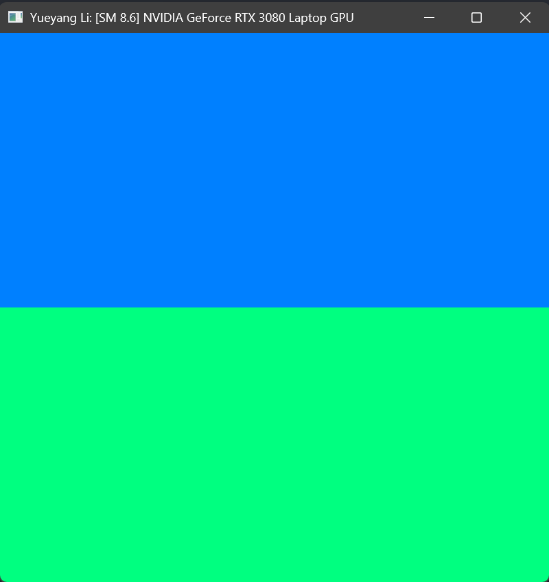
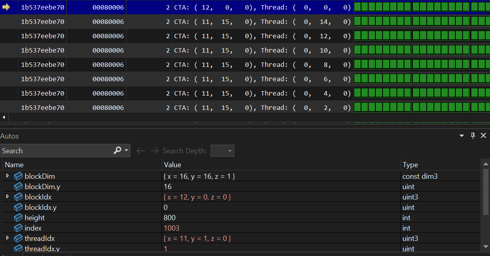
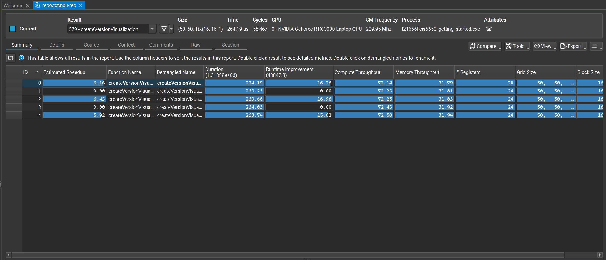

Project 0 Getting Started
====================

**University of Pennsylvania, CIS 5650: GPU Programming and Architecture, Project 0**

* Yueyang Li  
  * (TODO) [LinkedIn](https://www.linkedin.com/public-profile/settings?trk=d_flagship3_profile_self_view_public_profile), [personal website](ezelnomad.com), [twitter](), etc.
* Tested on: Windows11, i7-12700 @ 2.22GHz 64GB, GTX 3080 8GB (Personal Laptop Legion PC)

### Screen Shots

Include screenshots, analysis, etc. (Remember, this is public, so don't put
anything here that you don't want to share with the world.)
