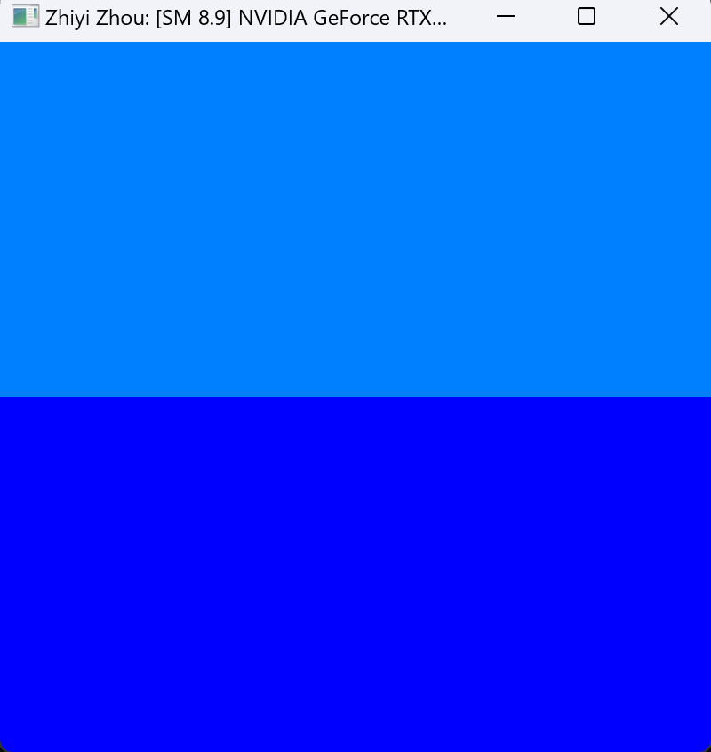
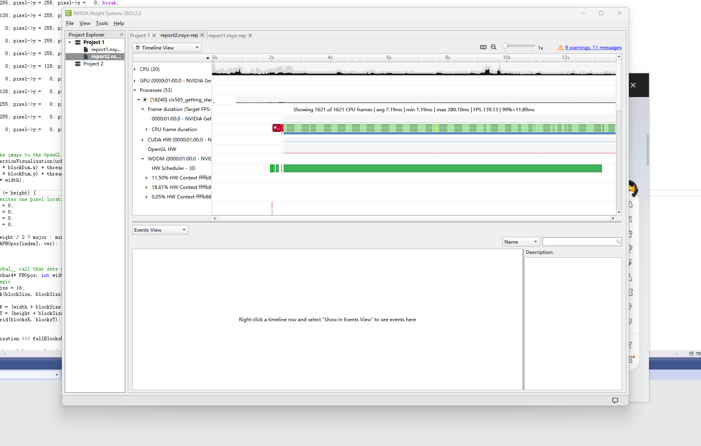
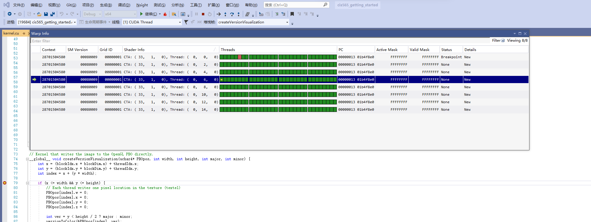
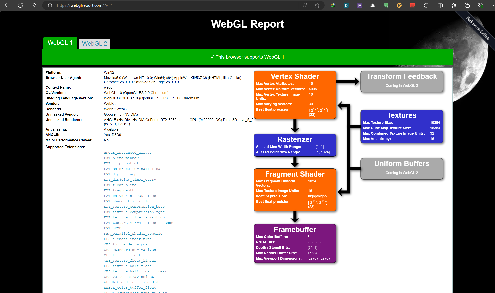
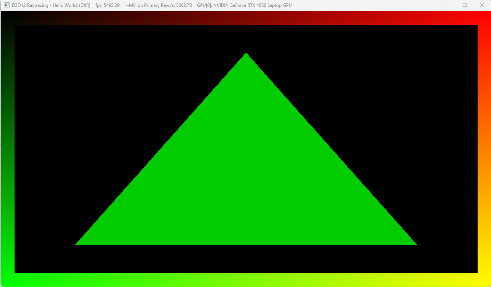

Project 0 Getting Started
====================

**University of Pennsylvania, CIS 5650: GPU Programming and Architecture, Project 0**

* Zhiyi Zhou
* Tested on: Windows 11, i9-13900H @ 2.6GHz 64GB, RTX4060 Laptop

