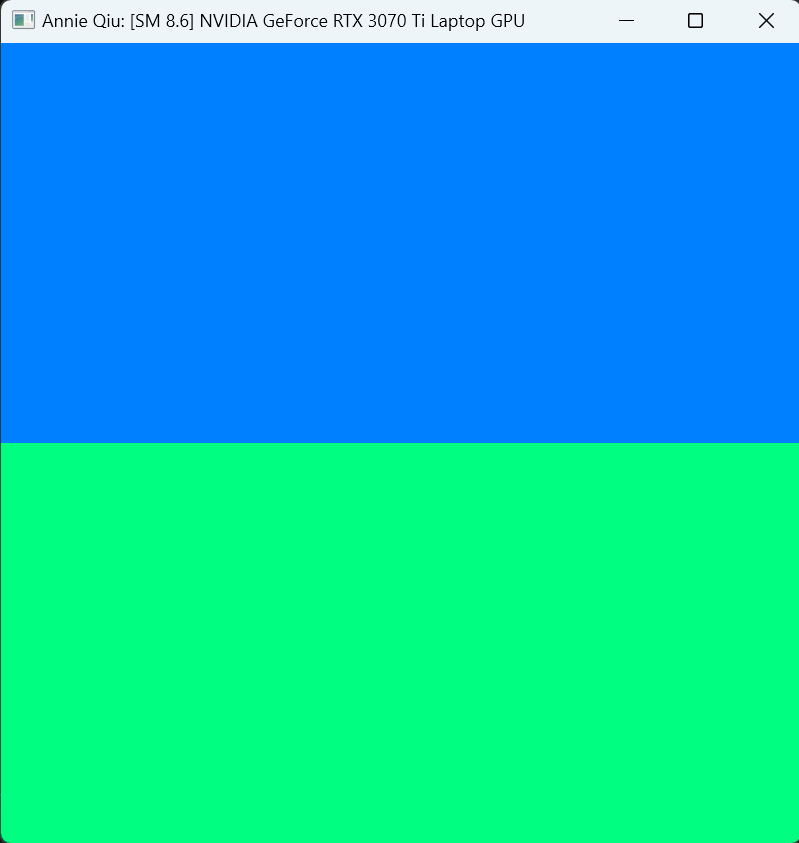
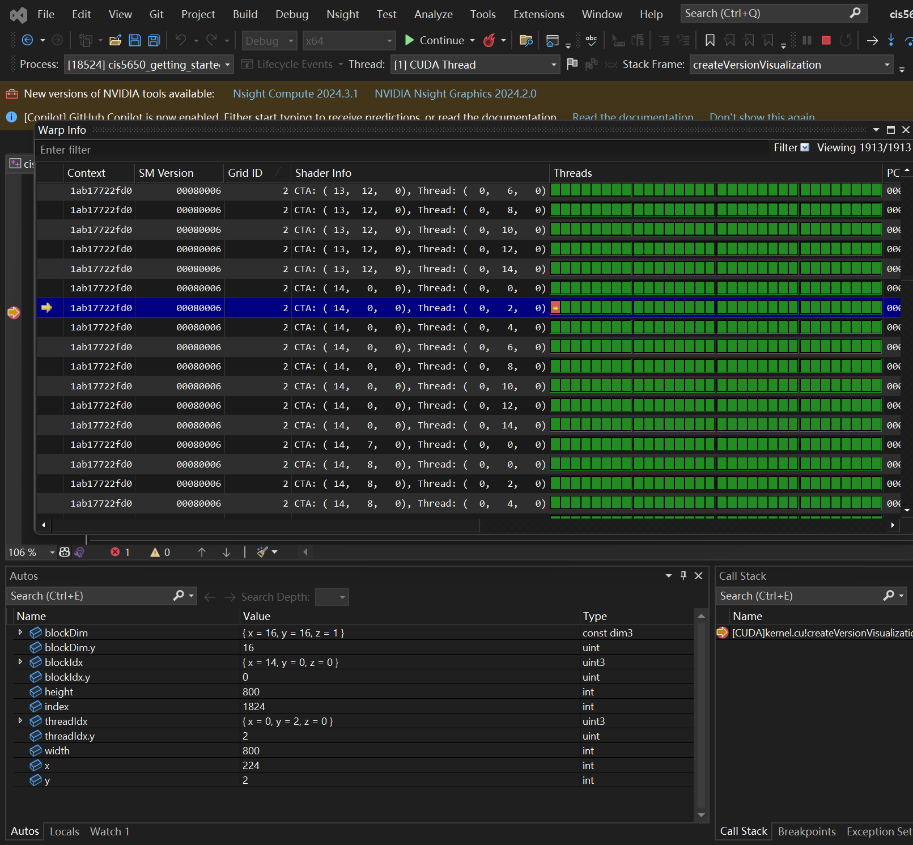
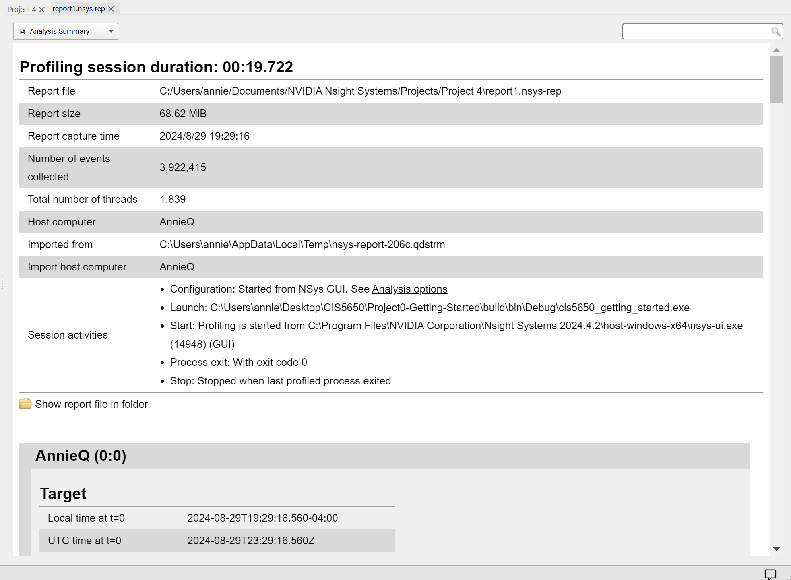
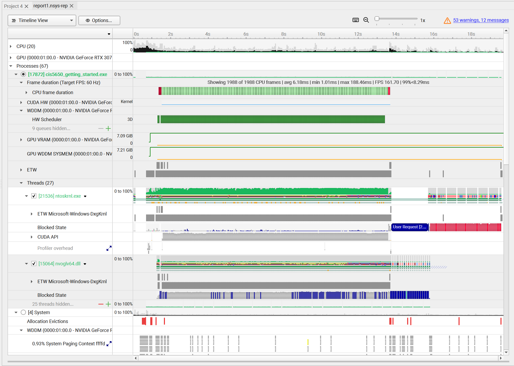
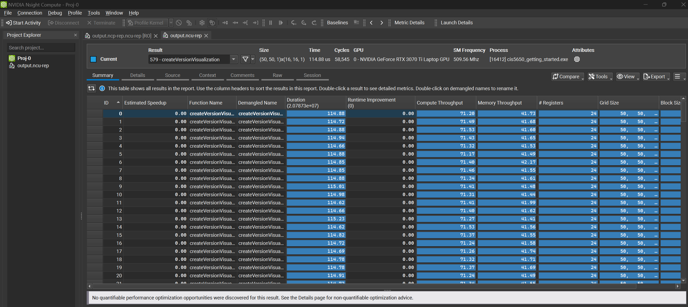
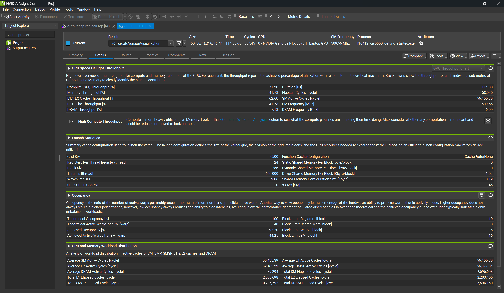
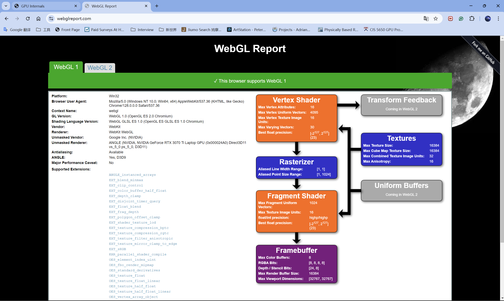
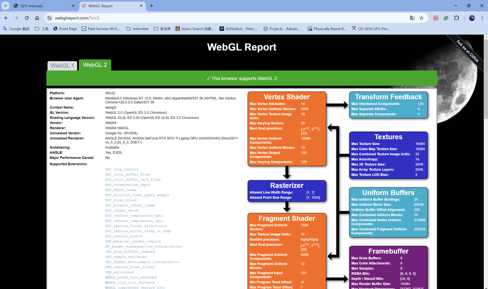
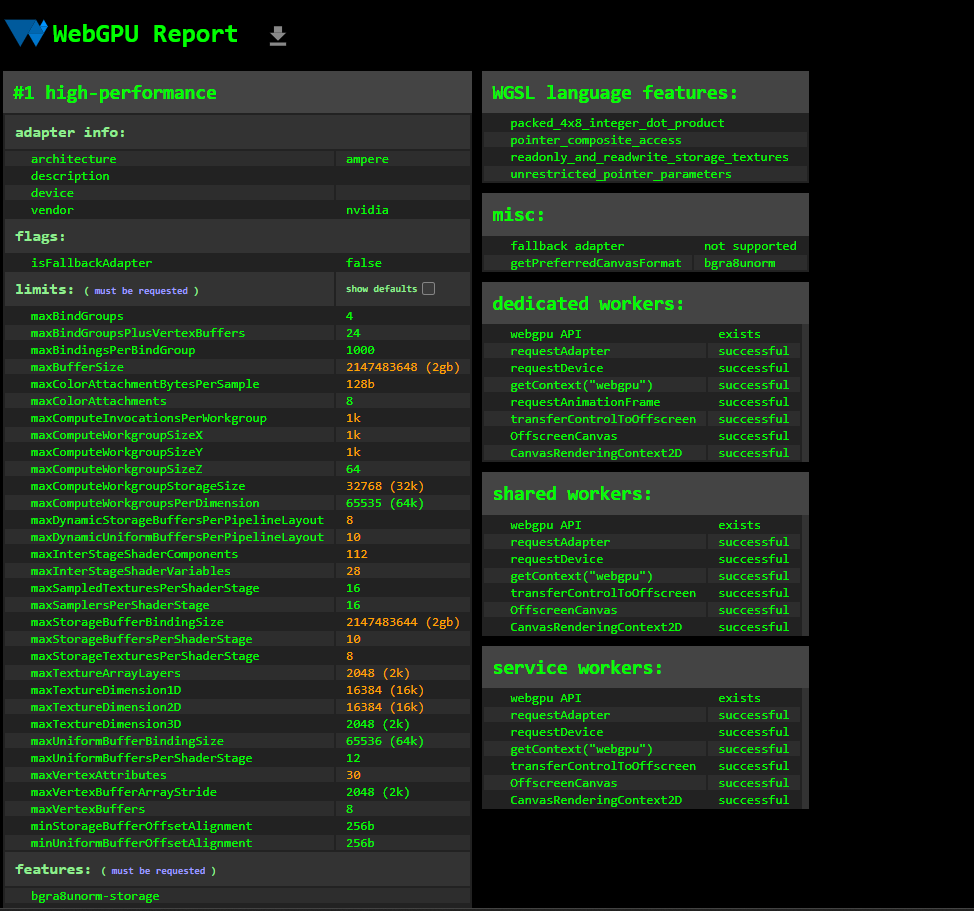
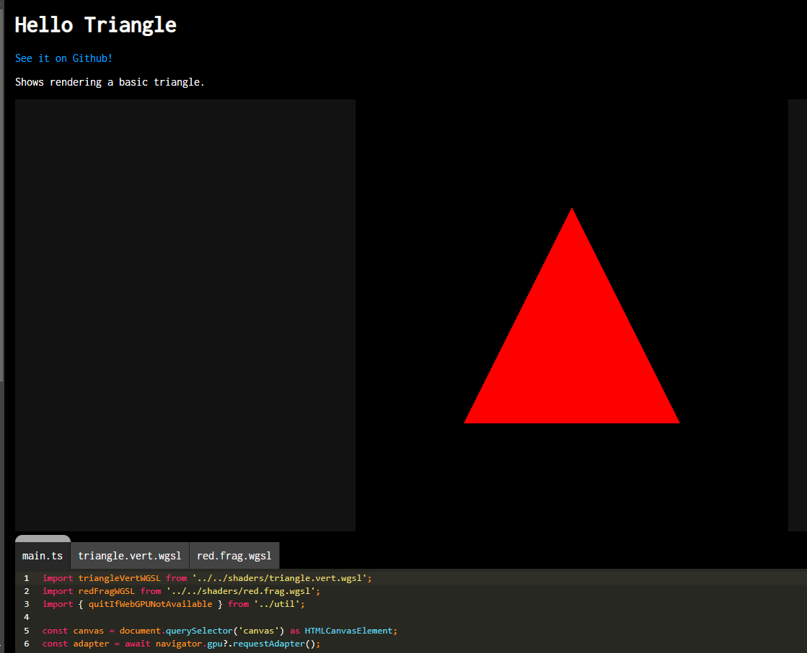

Project 0 Getting Started
====================

**University of Pennsylvania, CIS 5650: GPU Programming and Architecture, Project 0**

* Annie Qiu
  * [LinkedIn](www.linkedin.com/in/annie-qiu-30531921a)
* Tested on: Windows 11, i9-12900H @2500 Mhz, 16GB, RTX 3070 Ti 8GB (Personal)

## CUDA

### 2.1.2 Modify the CUDA Project

### 2.1.3 Nsight Debugging

### 2.1.4 Nsight System

### 2.1.5 Nsight Compute

### 2.2 WebGL

### 2.3 WebGPU

