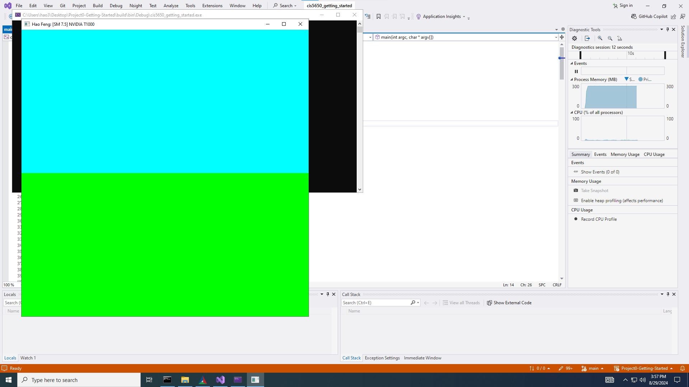
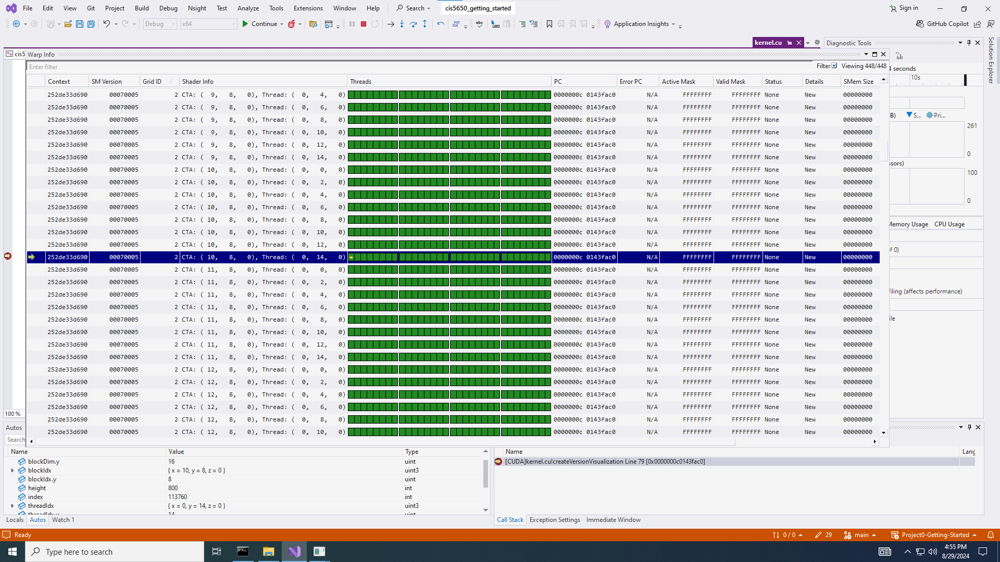
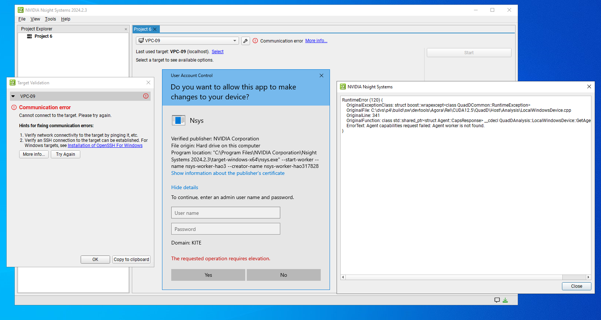
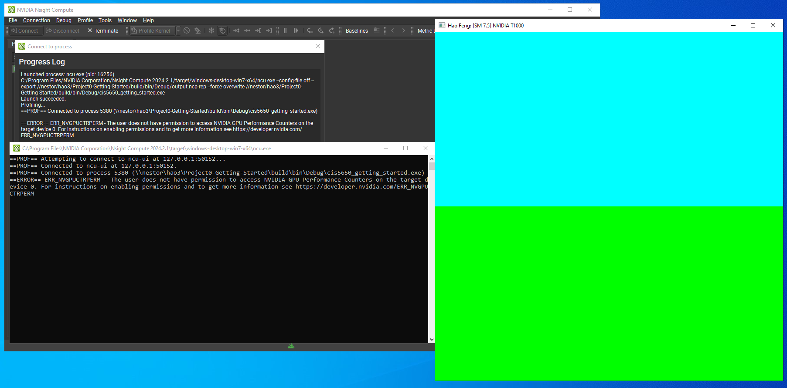
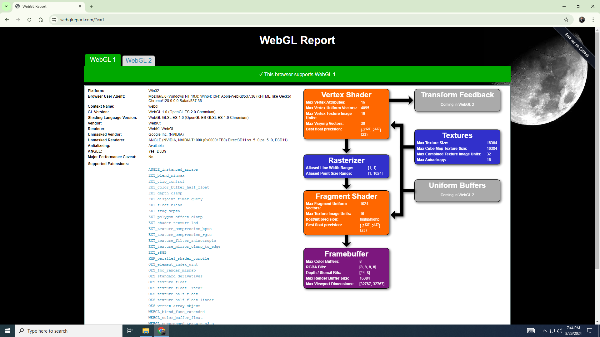
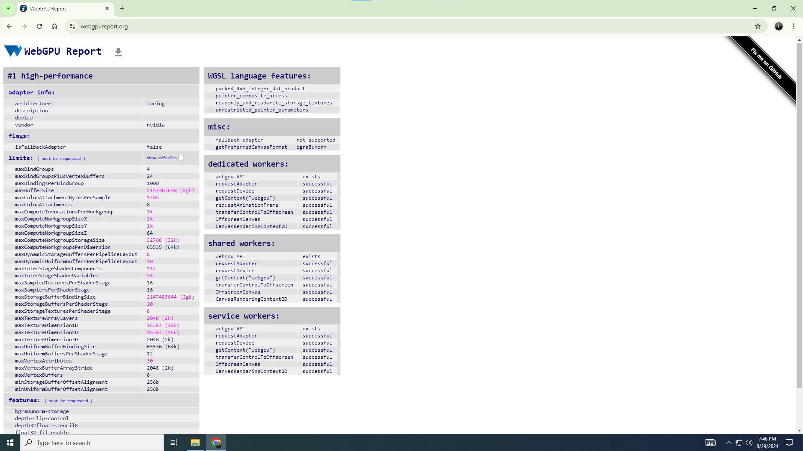

Project 0 Getting Started
====================

**University of Pennsylvania, CIS 5650: GPU Programming and Architecture, Project 0**

* Hao Feng
  * [LinkedIn](https://www.linkedin.com/in/haofeng0309/), [personal website](https://github.com/fenghao-0309)
* Tested on: Windows 10 Education 22H2, i7-12700 @ 2.10GHz 32.0GB, NVIDIA Quadro RTX T1000 (CETS Virtual Lab)

### Screenshots and analysis

#### Part 2.1.2

#### Part 2.1.3

#### Part 2.1.4
Since we do not have the acess to the admin user name and password, we fail to connect to the local server.

#### Part 2.1.5
In this part, after clicking \textit{Launch}, it has the error regarding GPU Performance Counters. We run the program for a few seconds and then close it. However, it did not generate the report.

#### Part 2.2

#### Part 2.3
