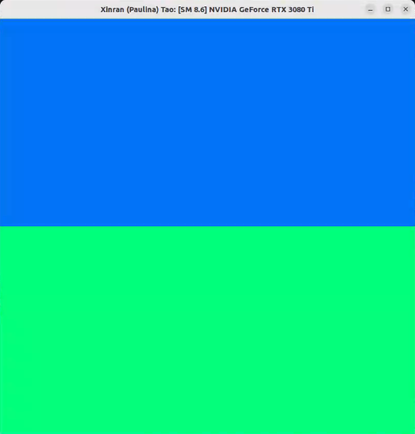
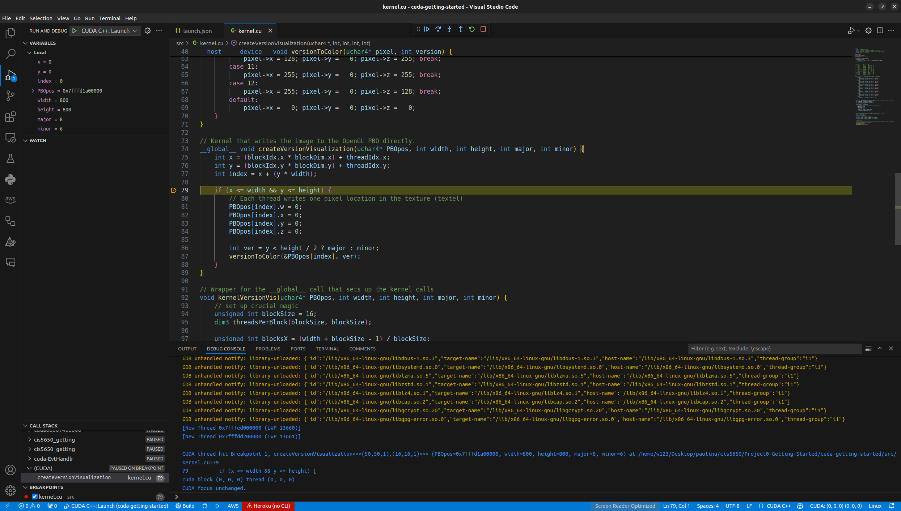
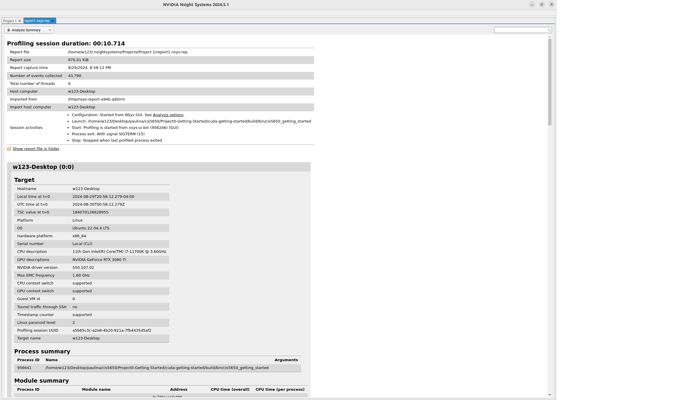
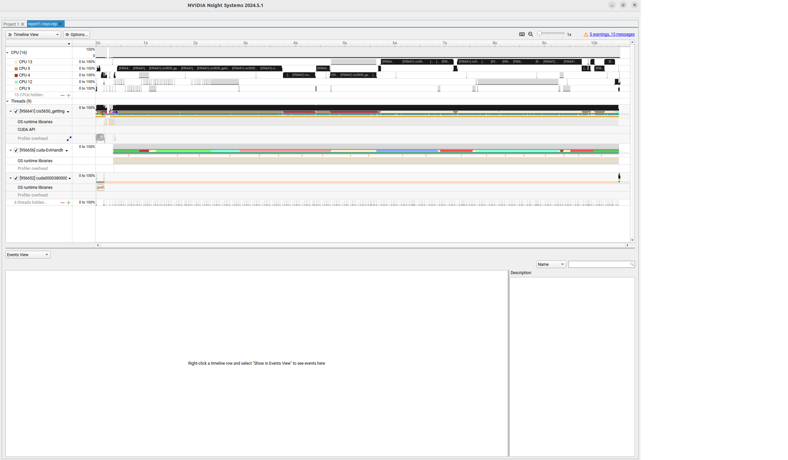
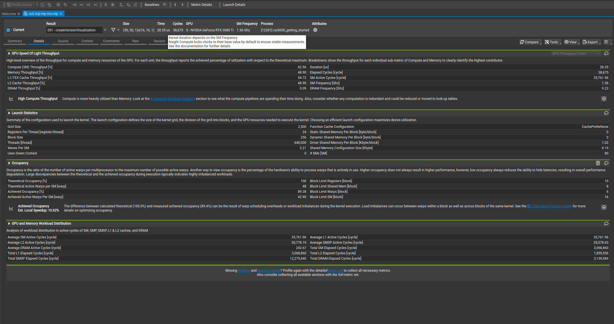
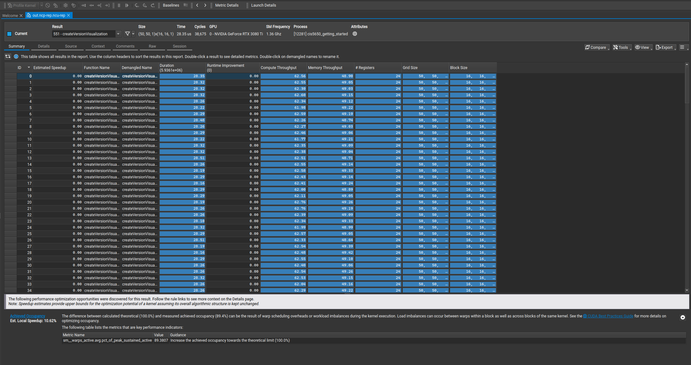
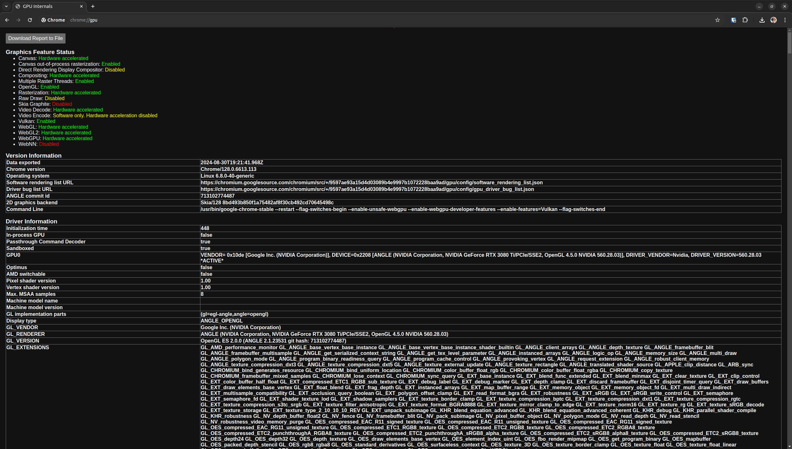
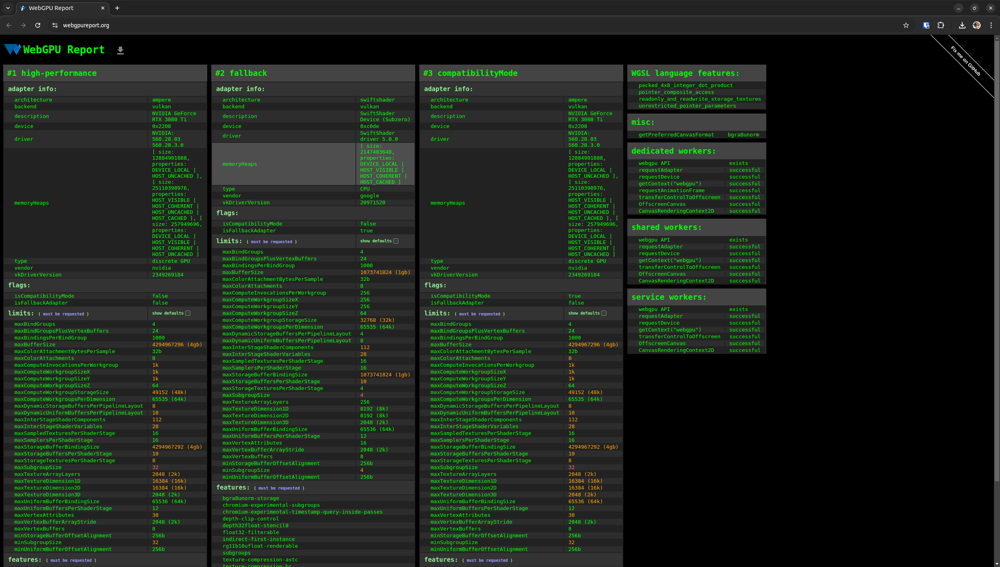

Project 0 Getting Started
====================

**University of Pennsylvania, CIS 5650: GPU Programming and Architecture, Project 0**

* Xinran Tao
  * [LinkedIn](https://www.linkedin.com/in/xinran-tao/), [Personal Website](https://www.xinrantao.com/), [GitHub](https://github.com/theBoilingPoint).
* Tested on: 
  - Ubuntu 22.04, i7-11700K @ 3.60GHz × 16, RAM 32GB, GeForce RTX 3080 Ti 12GB (Personal)

### Screenshots
#### Part 2.1.2: Modify the CUDA Project and Take a Screenshot

#### Part 2.1.3: Nsight Debugging
For this part, we are only required to attach screenshots for Windows according to `INSTRUCTION.md`. Nonetheless, I have attached the screenshot for reaching the breakpoint on my Linux system.

#### Part 2.1.4: Nsight Systems

#### Part 2.1.5: Nsight Compute

#### Part 2.2: Project Instructions - WebGL

#### Part 2.3: Project Instructions - WebGPU

