Project 0 Getting Started
====================

**University of Pennsylvania, CIS 5650: GPU Programming and Architecture, Project 0**

* Mufeng Xu
  * [LinkedIn](https://www.linkedin.com/in/mufeng-xu/)
* Tested on: Windows 11, i9-13900H @ 2.6GHz 32GB, RTX 4080 Laptop 12282MB (Personal)

### Screenshots

#### Part 2.1.2

Screenshot of the program running

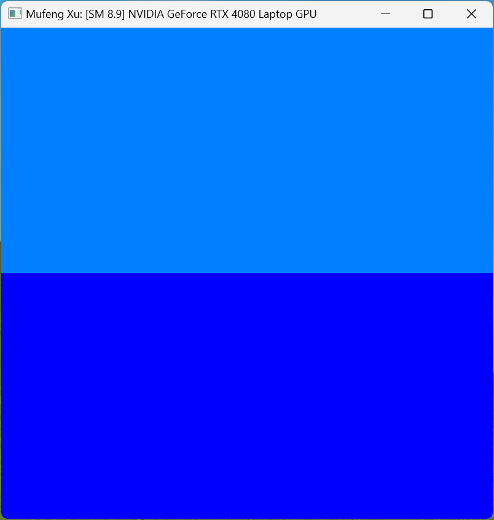

#### Part 2.1.3

Screenshot of Warp info and Autos & Locals at the breakpoint for `index == 3456`

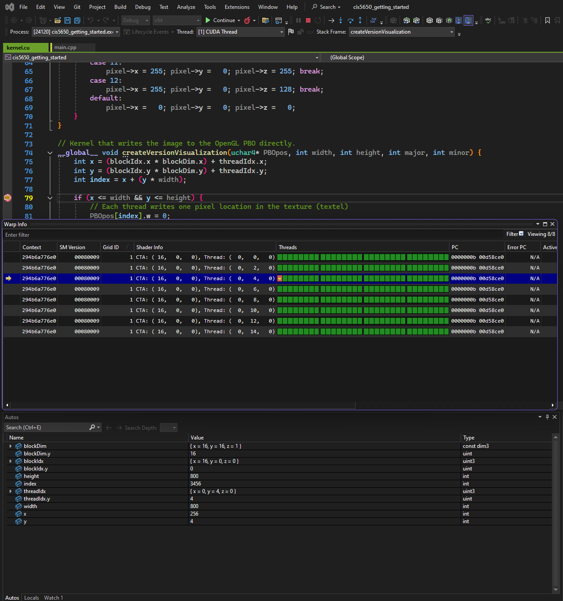

#### Part 2.1.4

Screenshots of *Analysis Summary* and the *Timeline* tabs in Nsight Systems

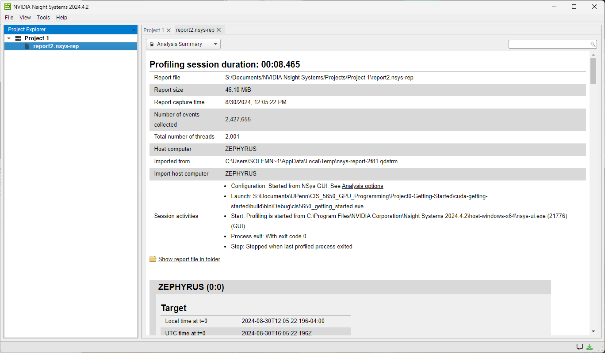

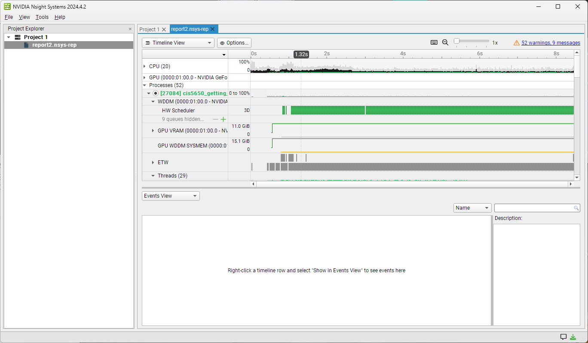

#### Part 2.1.5

Screenshots of *Summary* and *Details* in Nsight Compute

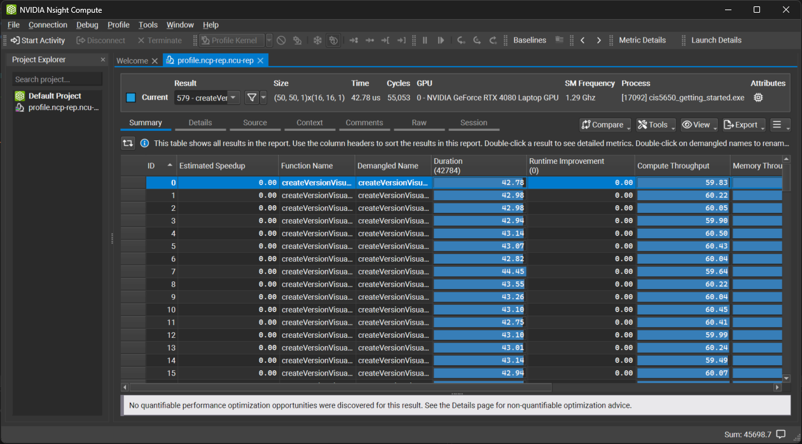

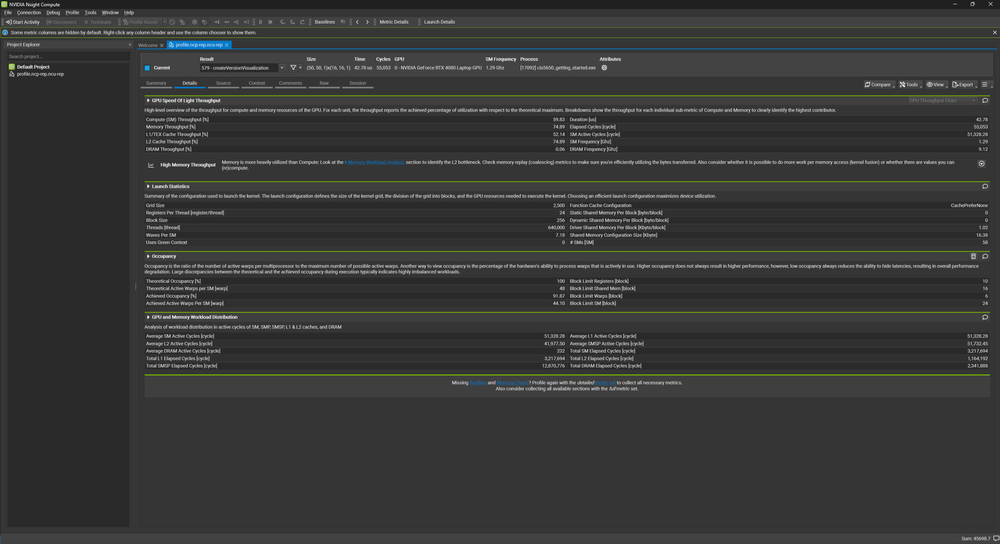

#### Part 2.2

Screenshots of https://webglreport.com

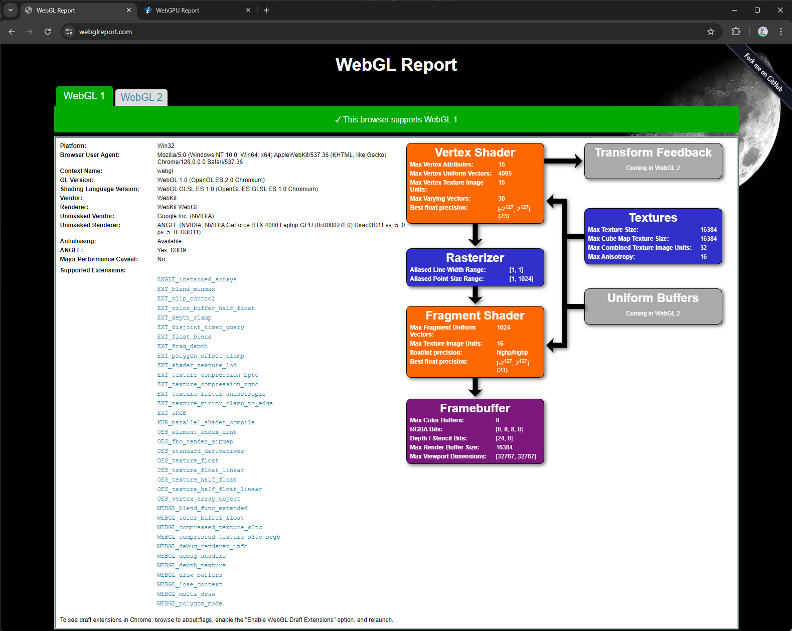
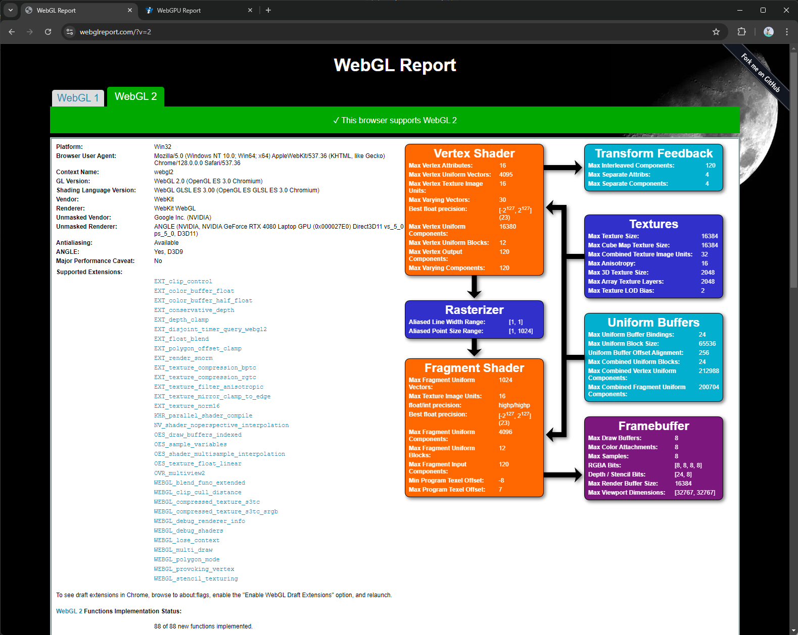

Screenshot of chrome://gpu

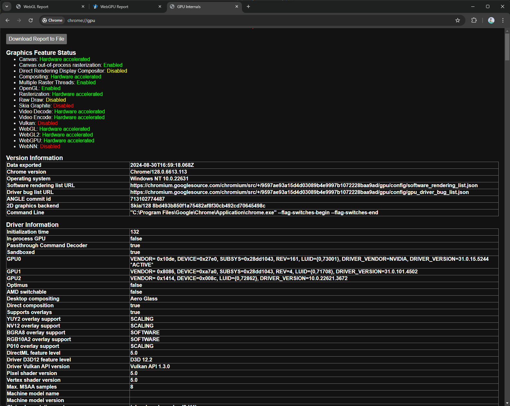

#### Part 2.3

Screenshot of https://webgpu.github.io/webgpu-samples/ demo

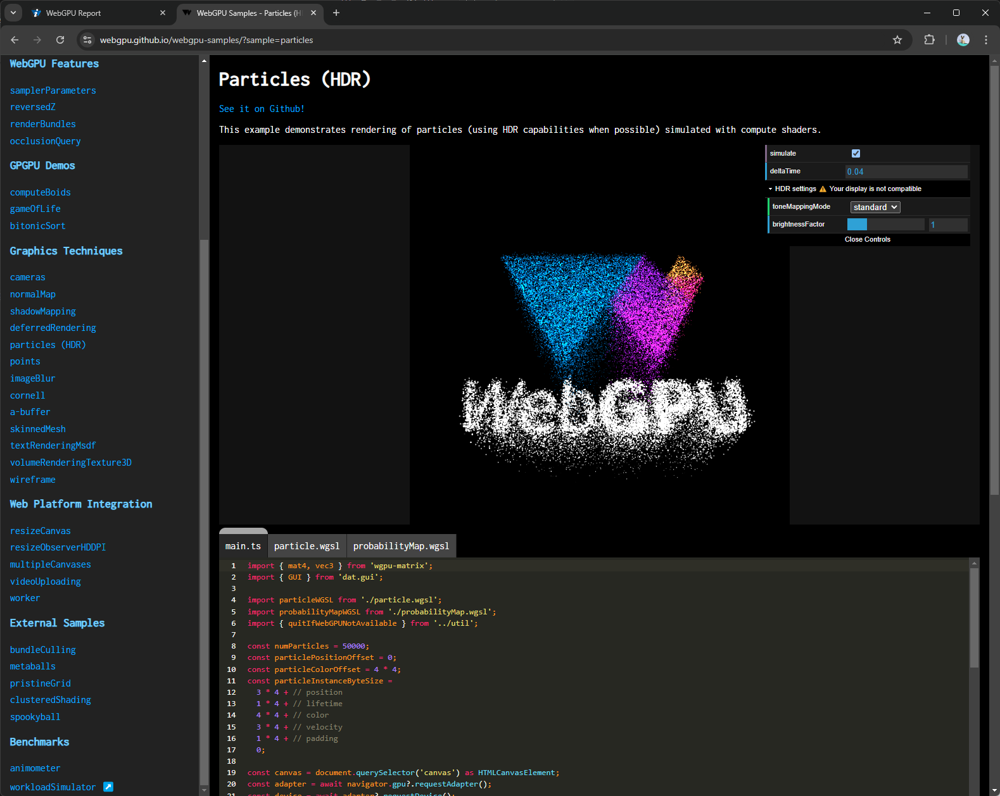

Screenshot of WebGPU report

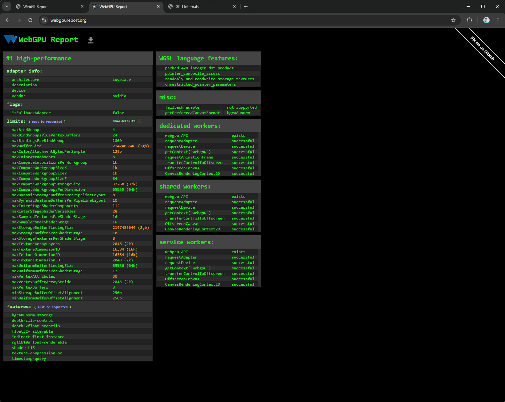