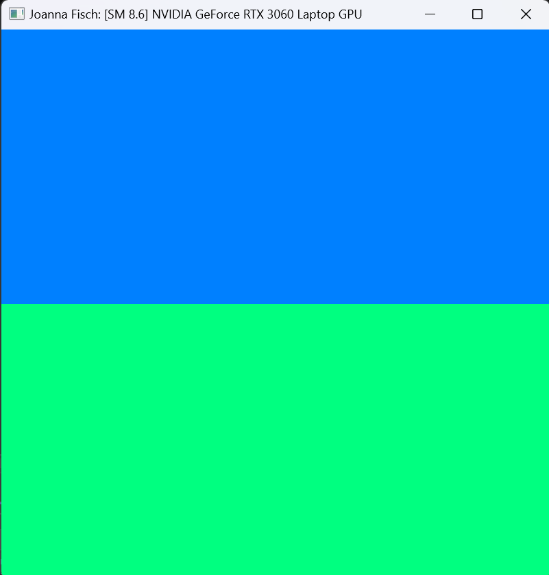
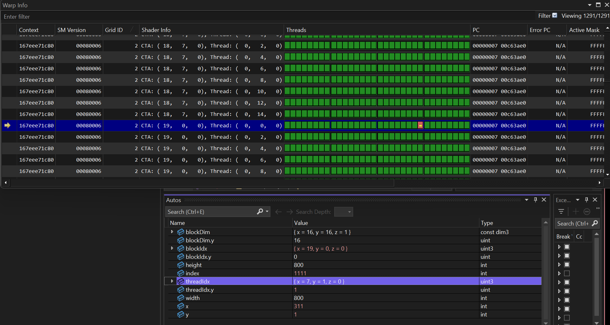
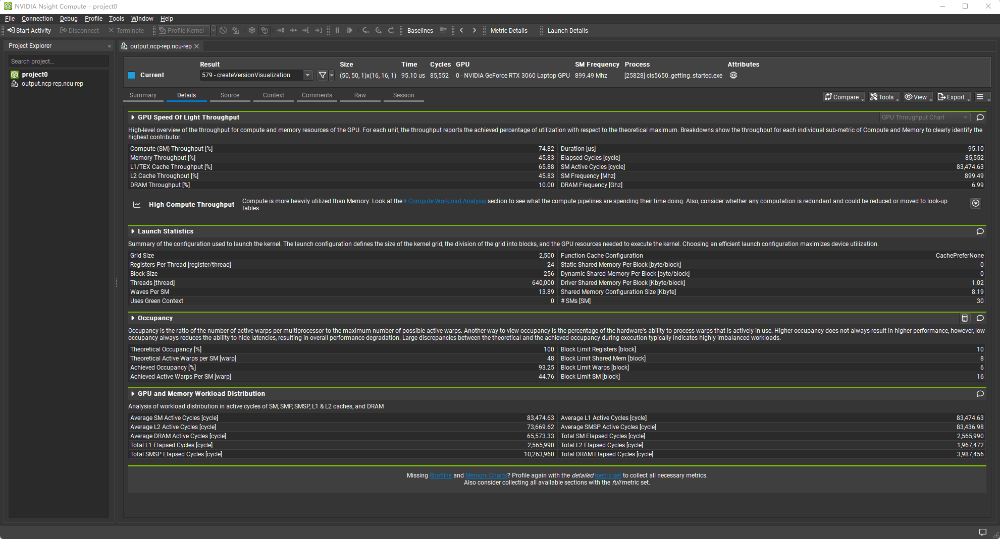
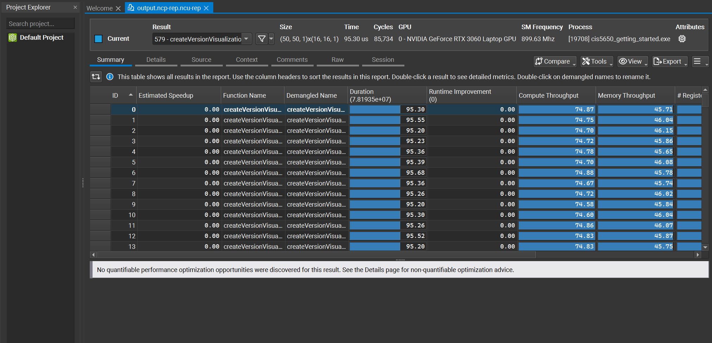

Project 0 Getting Started
====================

**University of Pennsylvania, CIS 5650: GPU Programming and Architecture, Project 0**

* Joanna Fisch
  * [LinkedIn](https://www.linkedin.com/in/joanna-fisch-bb2979186/), [Website](https://sites.google.com/view/joannafischsportfolio/home)
* Tested on: Windows 11, i7-12700H @ 2.30GHz 16GB, NVIDIA GeForce RTX 3060 (Laptop)

### Screenshots

## CUDA Installation

## NSight Debugging

## NSight Systems
Analysis

Timeline

## NSight Compute
Details

Summary

## WebGL

## WebGPU

