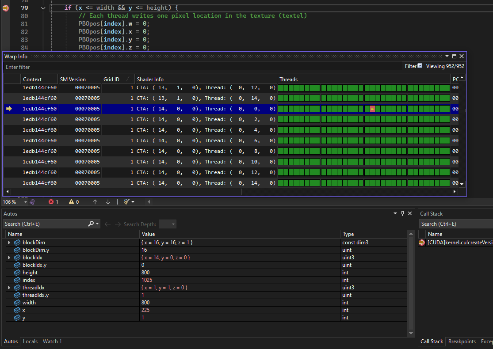
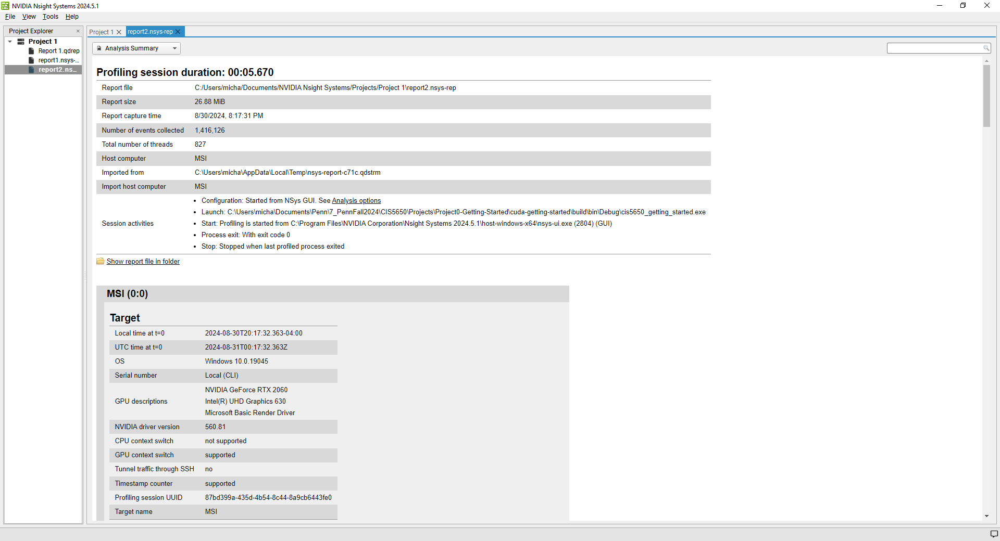
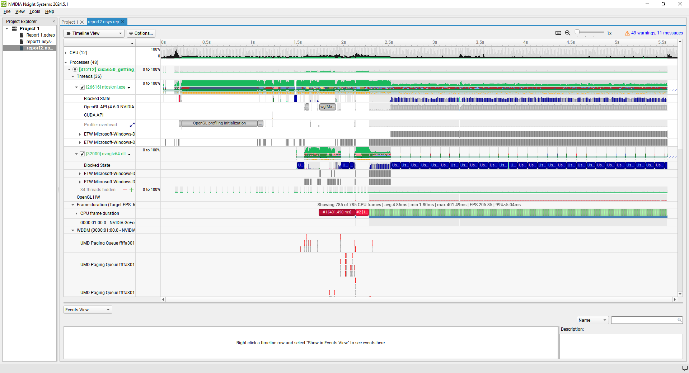
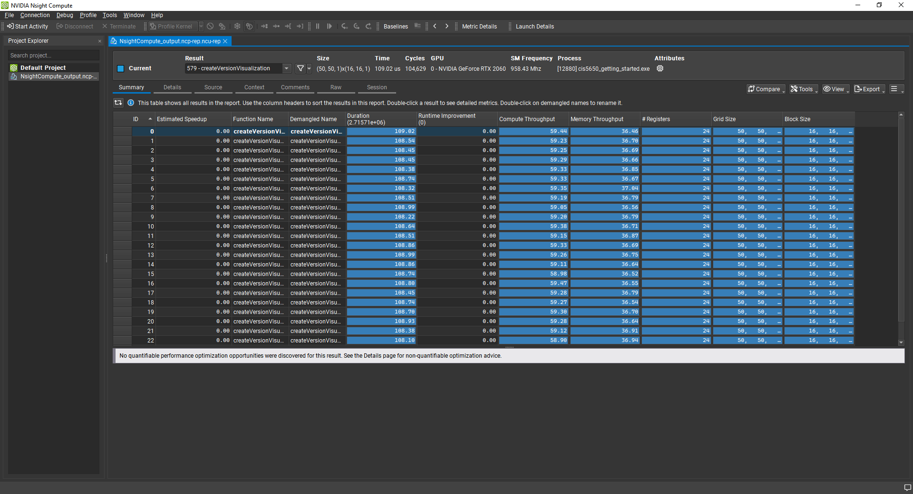
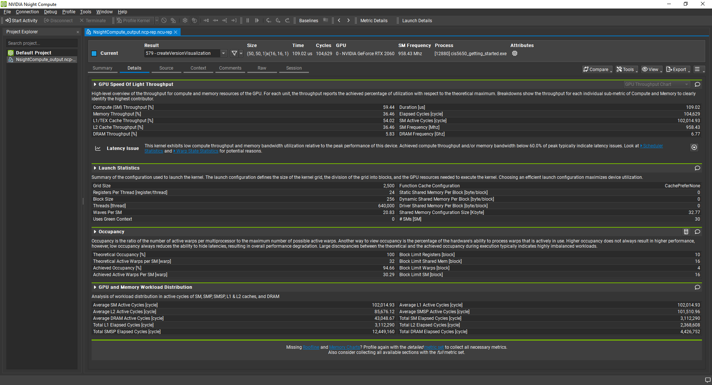
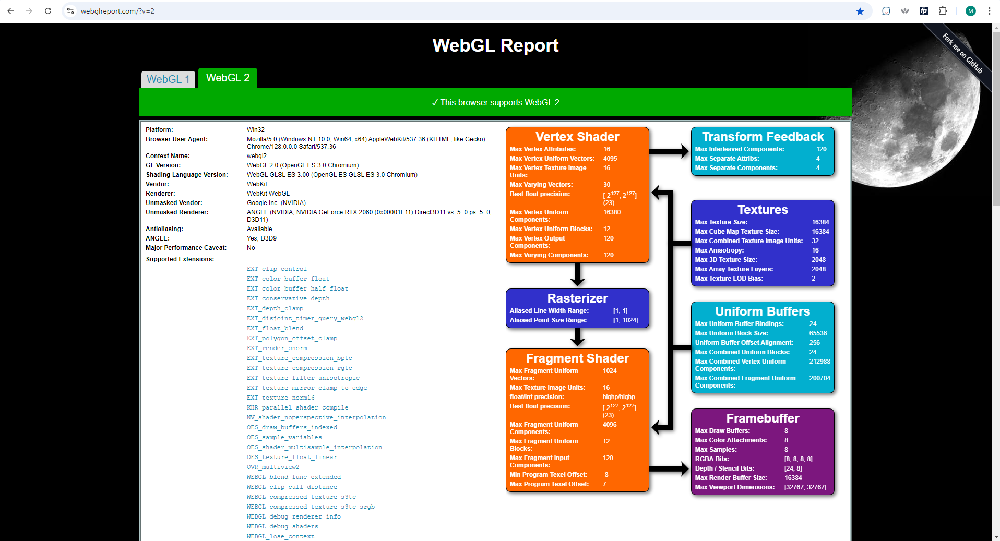
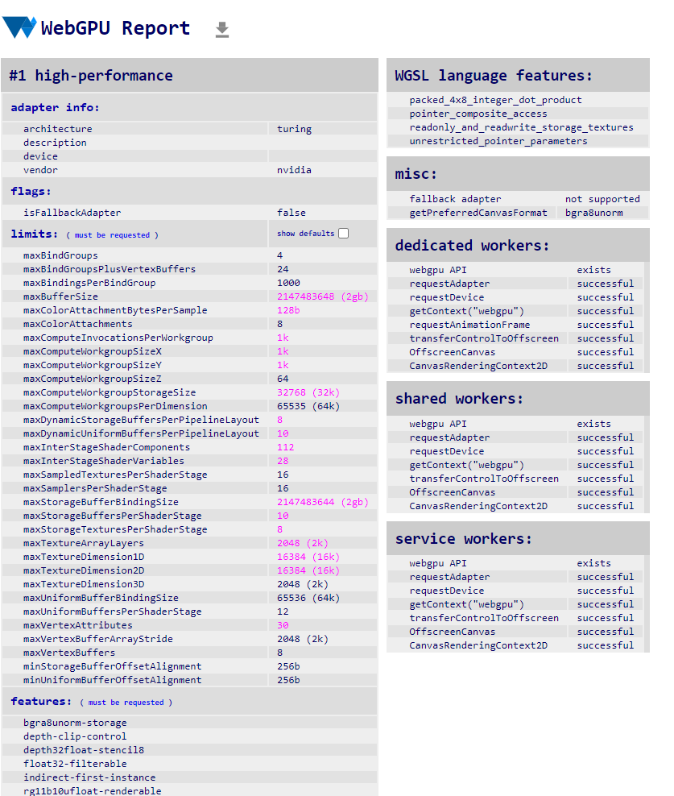
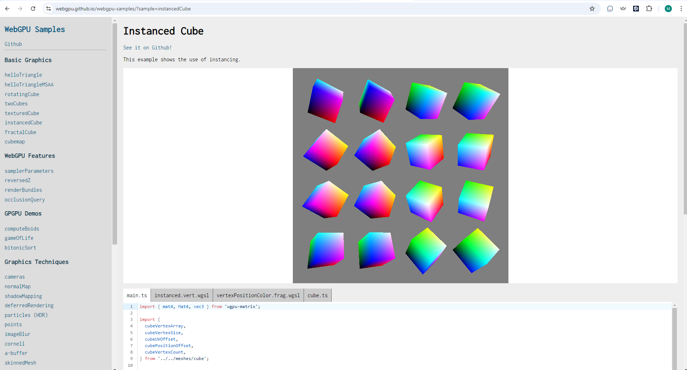

Project 0 Getting Started
====================

**University of Pennsylvania, CIS 5650: GPU Programming and Architecture, Project 0**

* Michael Rabbitz
  * https://www.linkedin.com/in/mike-rabbitz/
* Tested on: Windows 10, i7-9750H @ 2.60GHz 32 GB, RTX 2060 6GB (Personal)

## CUDA Compute Capability
### The CUDA Compute Capability of the RTX 2060 is 7.5 as displayed in the following image

## Nsight Debugging
### Breakpoint condition set to index == 1025
In the snapshot, we reside in block index (x = 14, y = 0, z = 0) and thread index (x = 1, y = 1, z = 0).

The block index is represented by both:

1) in the Autos window - variable blockIdx, and
2) in the Warp Info window - CTA in the Shader Info column

The thread index is represented by both:

1) in the Autos window - variable threadIdx, and
2) in the Warp Info window - a combination of Thread in the Shader Info column, and the square with a yellow arrow in a red background in the Threads column

We deduce the threadIdx from the Warp Info window by first taking the value of Thread (x = tx, y = ty, z = tz), which in the snapshot is value (x = 0, y = 0, z = 0) in the highlighted row. This value is the threadIdx of the leftmost square of the 4 green groups of squares (segments) in the Threads column. From within the Threads column, the 2 leftmost segments hold the same y value as Thread's y value (ty), and the 2 rightmost segments hold a y value of ty + 1. In the snapshot, this gives us threadIdxs of (x, ty = 0, 0) and (x, ty + 1 = 1, 0), respectively. Both 2 leftmost segments and 2 rightmost segments consist of 16 squares. In each of the 2 segments, each square is given an threadIdx x value from 0 to 15, left to right. This gives the square with a yellow arrow in a red background an x value of 1, and ultimately proves why the threadIdx of that square is (x = 1, y = 1, z = 0).

## Nsight Systems
### Analysis Summary

### Timeline View

## Nsight Compute
### Summary

### Details

## WebGL 2 Compatability
### From https://webglreport.com/?v=2

## WebGPU Compatability
### From https://webgpureport.org

### From https://webgpu.github.io/webgpu-samples/?sample=instancedCube

