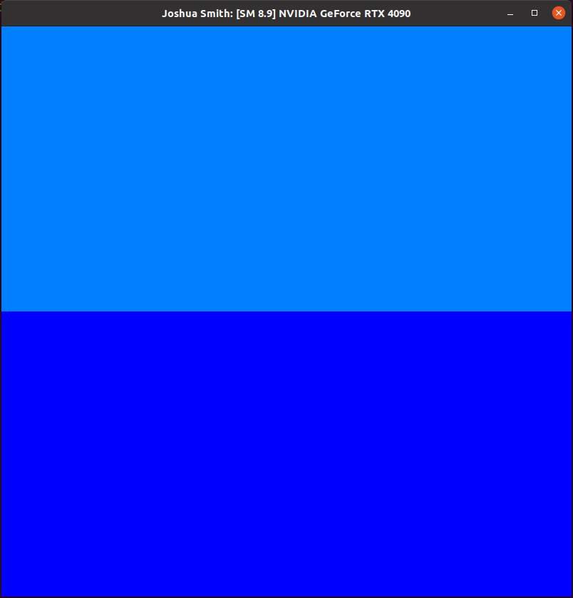
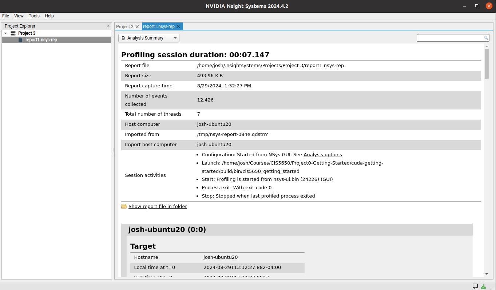
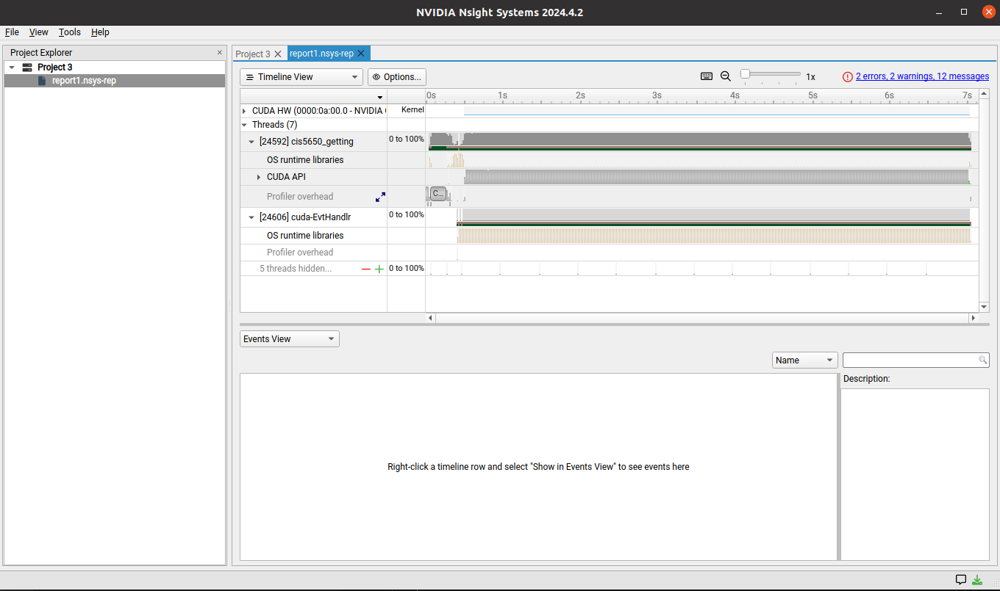
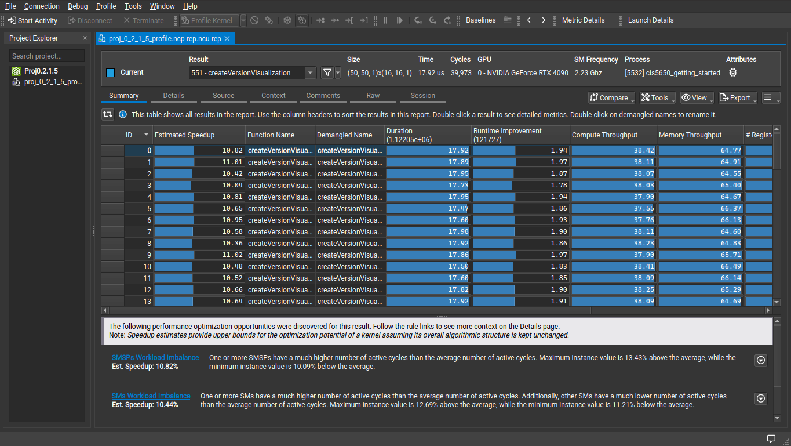
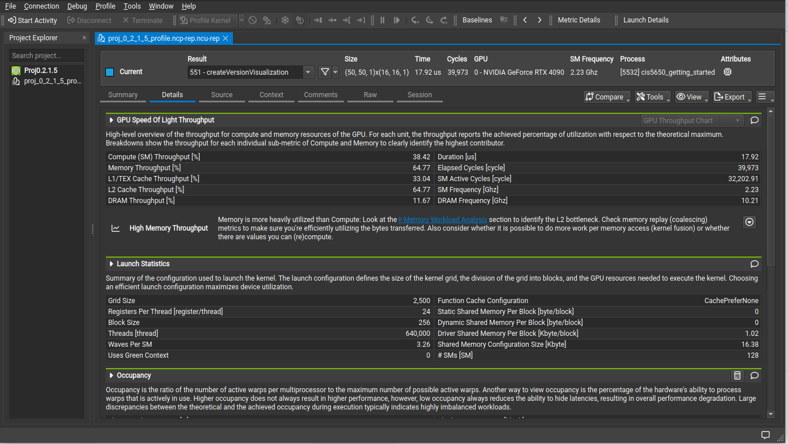
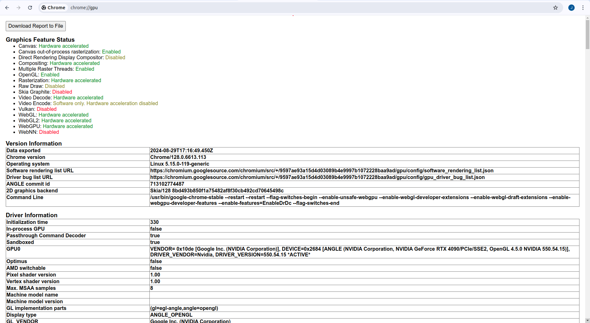
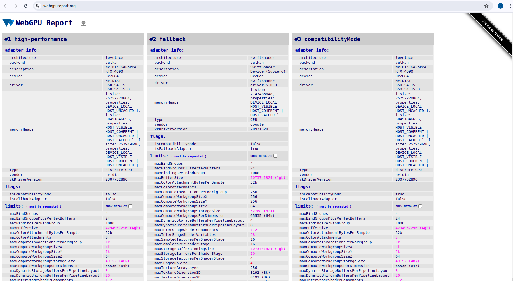

Project 0 Getting Started
====================

**University of Pennsylvania, CIS 5650: GPU Programming and Architecture, Project 0**

* Joshua Smith
  * [LinkedIn](https://www.linkedin.com/in/joshua-smith-32b165158/)
* Tested on: Ubuntu 20.04, Ryzen 9 3900x @ 4.6GHz, 24GB RTX 4090 (Personal)

### (Screenshots of working env setup)

**2.1.2 Modified executable window**

**2.1.4 NSight Systems Analysis Summary and Timeline**

**2.1.5 NSight Compute Summary and Details Tab**

**2.2 WebGL chrome:\\\\gpu info**

**2.3 WebGpu webgpureport**

