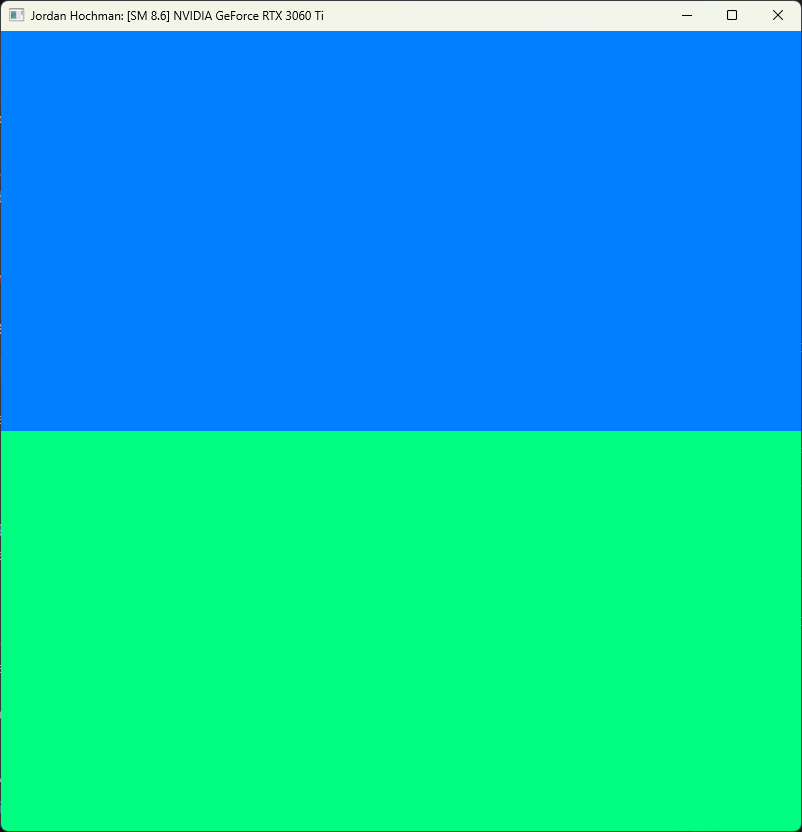
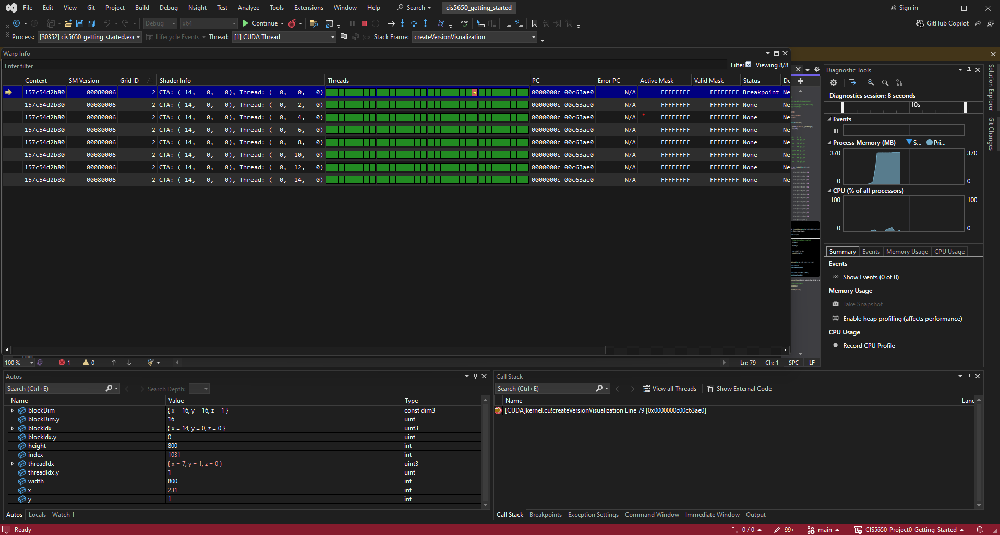
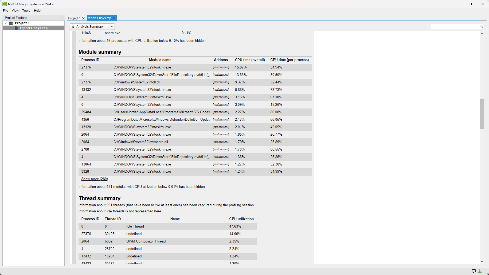
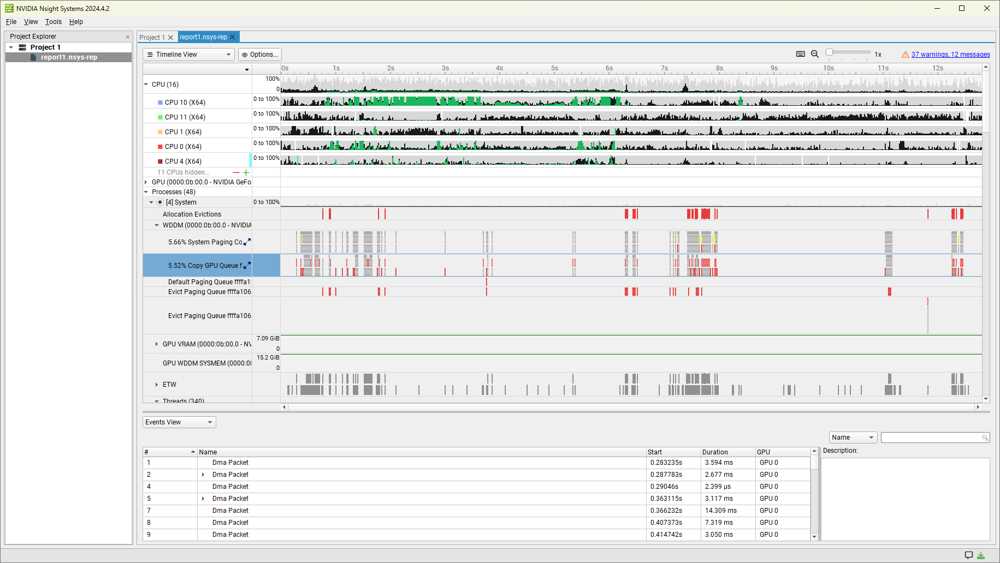
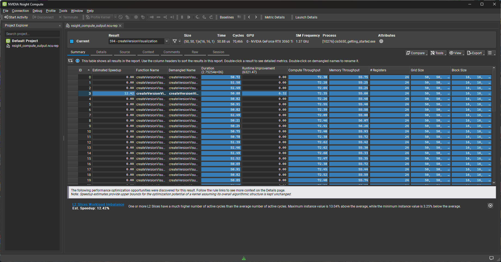
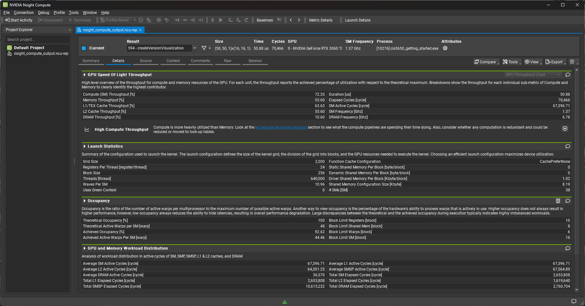
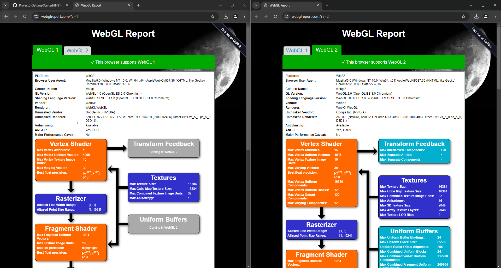
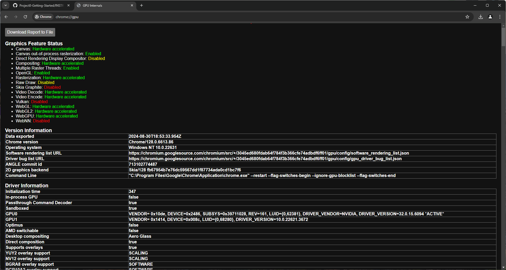
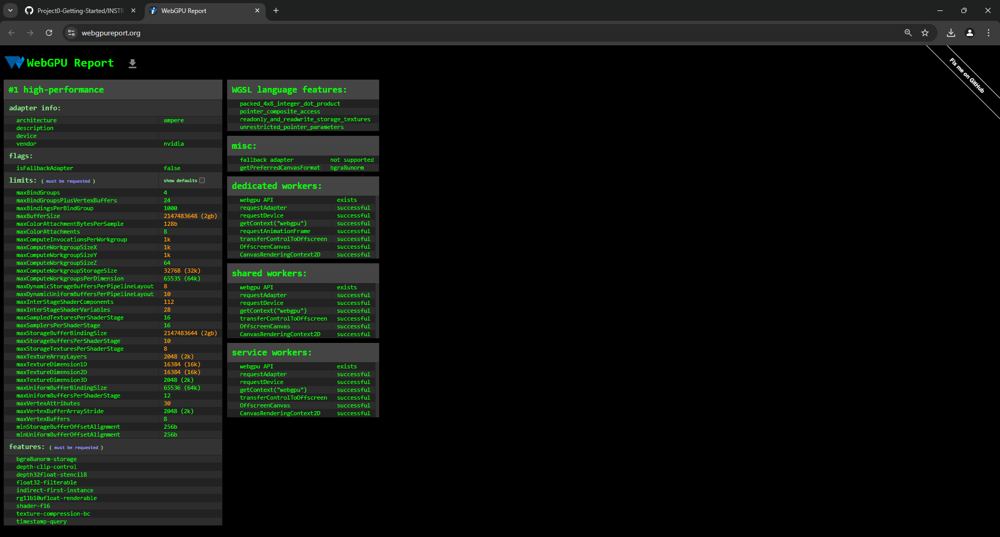
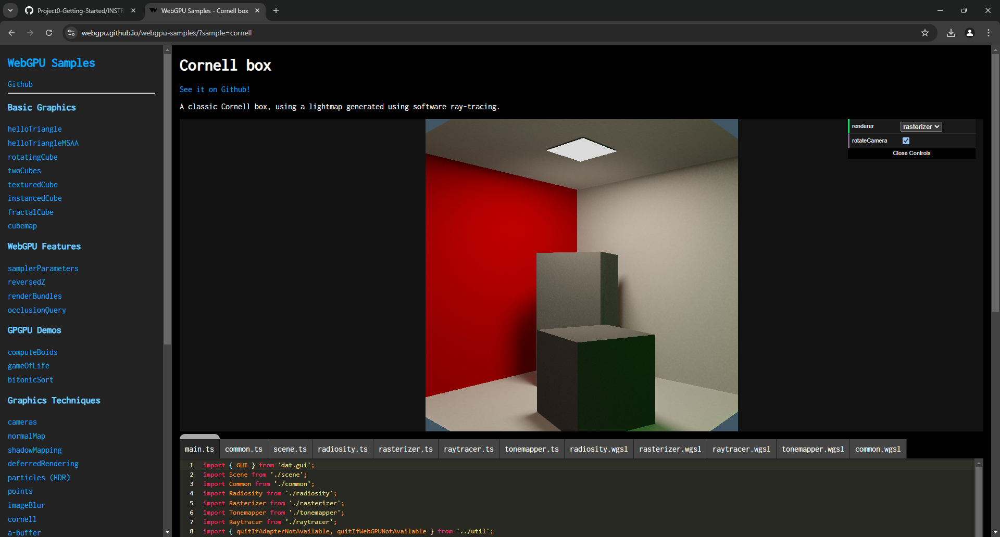

Project 0 Getting Started
====================

**University of Pennsylvania, CIS 5650: GPU Programming and Architecture, Project 0**

* Jordan Hochman
  * [LinkedIn](https://www.linkedin.com/in/jhochman24), [Personal Website](https://jordanh.xyz), [GitHub](https://github.com/JHawk0224)
* Tested on: Windows 11, Ryzen 7 5800 @ 3.4GHz 32GB, GeForce RTX 3060 Ti 8GB (Compute Capability: 8.6)

## Welcome to my Project 0!

This project is just to check the system readiness of my GPU and computer. This `README.md` follows along with the instructions in `INSTRUCTION.md`, and the images and reports from each section will be given below. The system information that these reports were gathered from is mentioned above.

### Part 2.1.1: Compute Capability of CUDA-compatible GPU

As you can see above, the [compute capability (SM)](https://developer.nvidia.com/cuda-gpus) of my GPU (NVIDIA GeForce RTX 3060 Ti) is 8.6.

### Part 2.1.2: Running the CUDA Project

Below is the image generated by running the CUDA project (`cuda-getting-started`) included in this repository:

### Part 2.1.3: Nsight Debugging

Below is the image of running the [Nsight Debugger](https://docs.nvidia.com/nsight-visual-studio-edition/index.html) on the CUDA project. It includes the information from the *Autos* window and the *Warp Info* window.

### Part 2.1.4: Nsight Systems

Here are the images of running [Nsight Systems](https://docs.nvidia.com/nsight-systems/UserGuide/index.html) on my computer while running the CUDA project. The first one is from the *Analysis Summary* tab, and the second one is from the *Timeline* tab. The entire generated report is available [here](reports/nsight_systems_report.nsys-rep) as `reports/nsight_systems_report.nsys-rep`.

### Part 2.1.5: Nsight Compute

Here are the images of running [Nsight Compute](https://docs.nvidia.com/nsight-compute/) on my computer while running the CUDA project. The first one is from the *Summary* tab, and the second one is from the *Details* tab. The entire generated report is available [here](reports/nsight_compute_output.ncu-rep) as `reports/nsight_compute_output.ncu-rep`.

### Part 2.2: WebGL

Here are the screenshots for checking the status of WebGL support on my computer. The first one is from https://webglreport.com and the second one is from chrome:\\\\gpu. You can see that WebGL is supported on my machine, and the generated report from `chrome:\\\\gpu` is available [here](reports/about-gpu.txt) as `reports/about-gpu.txt`.

### Part 2.3: WebGPU

Here are the screenshots for checking the status of WebGPU support on my computer. The first one is from https://webgpureport.org and the second one is from the `cornell` sample on https://webgpu.github.io/webgpu-samples/. You can see that WebGPU is supported on my machine, and the generated report from `https://webgpureport.org` is available [here](reports/webgpureport.txt) as `reports/webgpureport.txt`.

