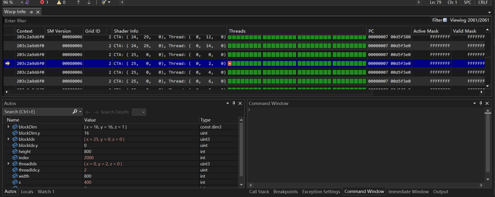
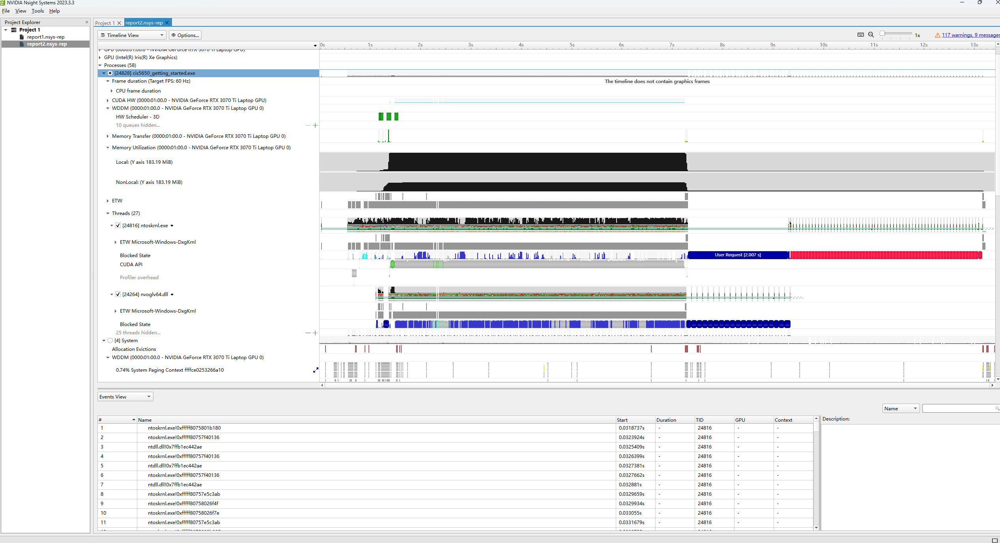
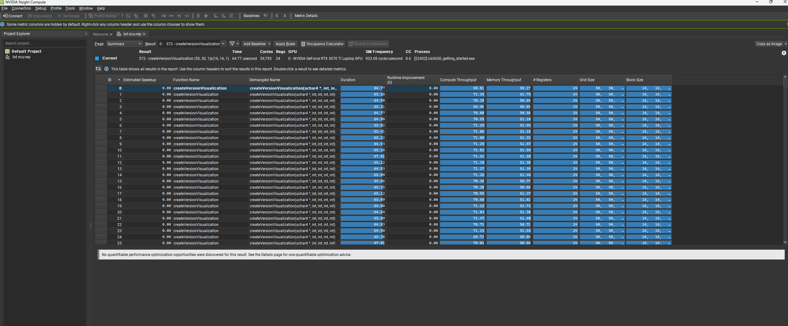
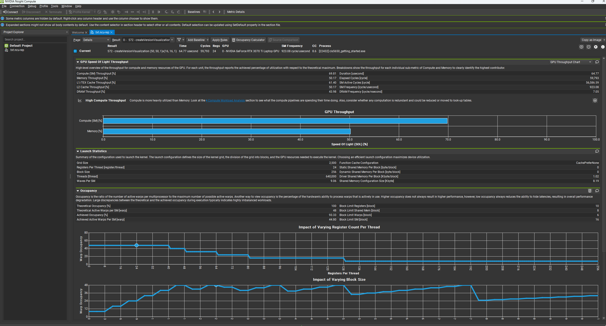
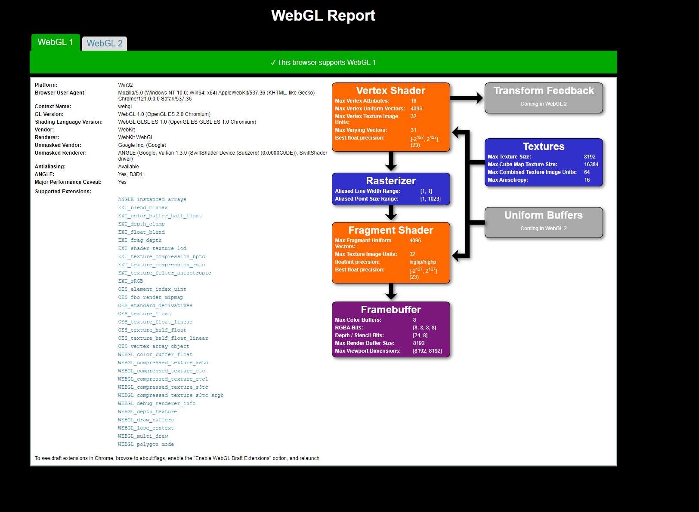
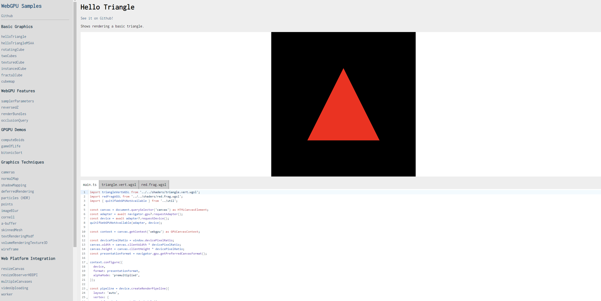

Project 0 Getting Started
====================

**University of Pennsylvania, CIS 5650: GPU Programming and Architecture, Project 0**

* Akiko Zhu
  * [LinkedIn](https://www.linkedin.com/in/geming-akiko-zhu-b6705a255/)
* Tested on: Windows 11, i9-12900H @ 2.50GHz 16GB, RTX 3070Ti 8GB (Personal)

### README

