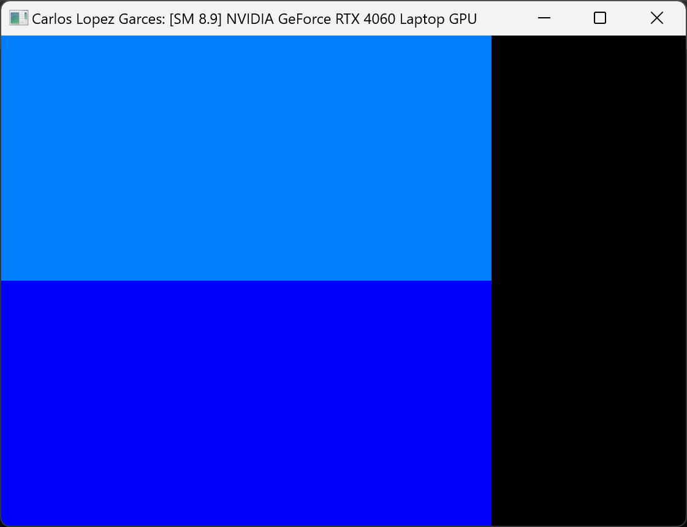
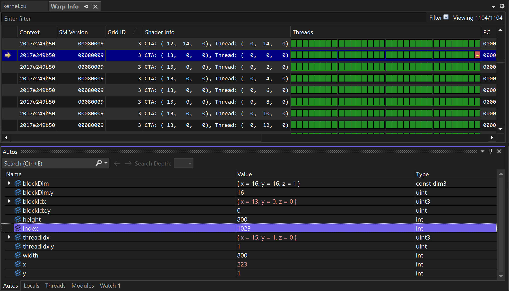
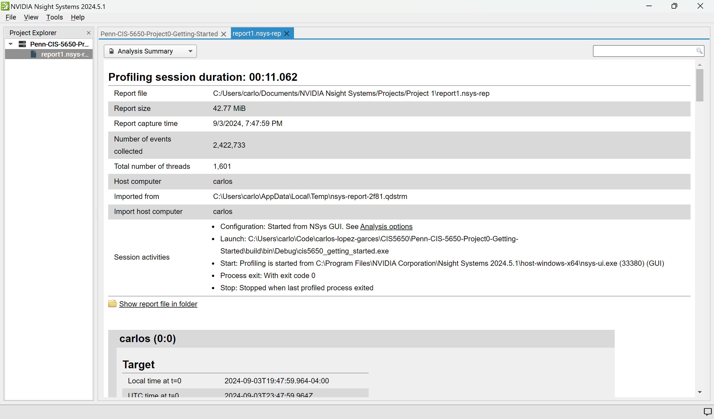
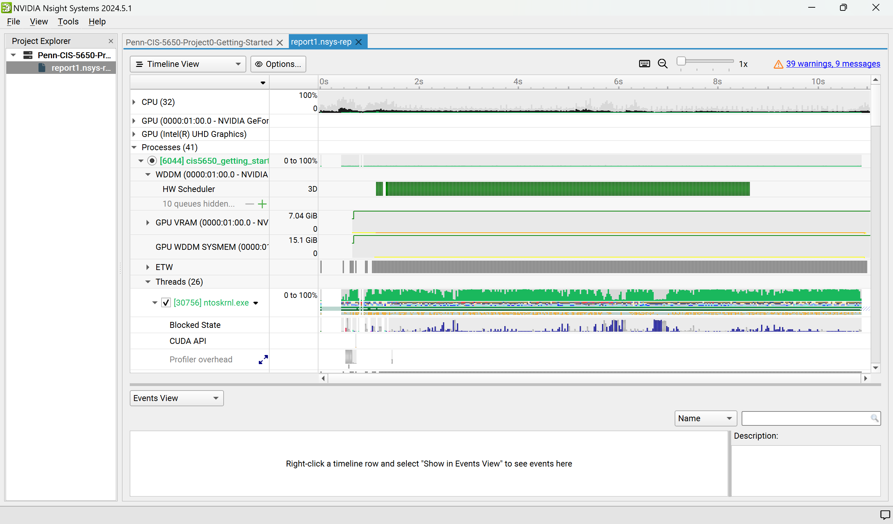
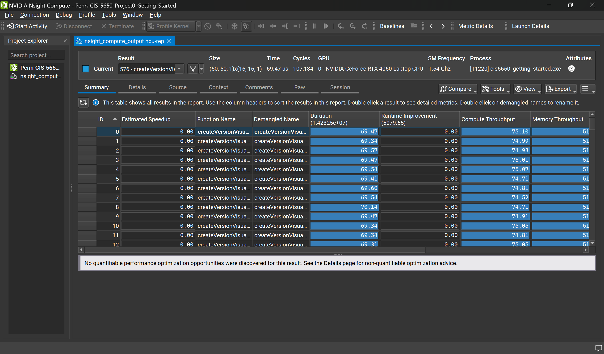
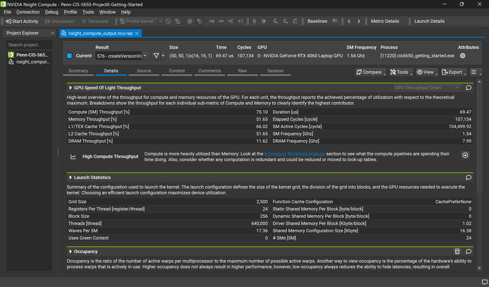
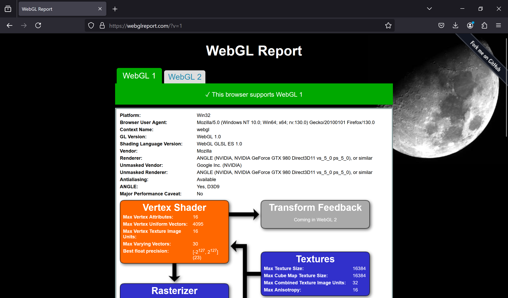
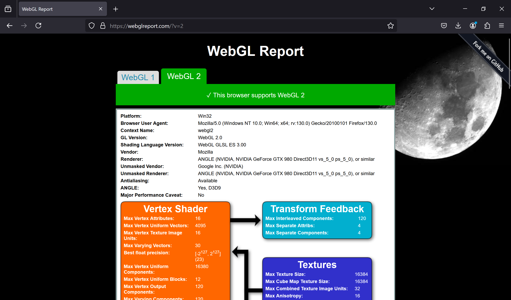
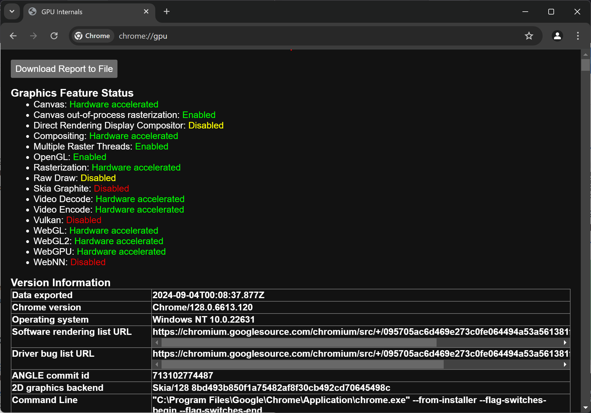
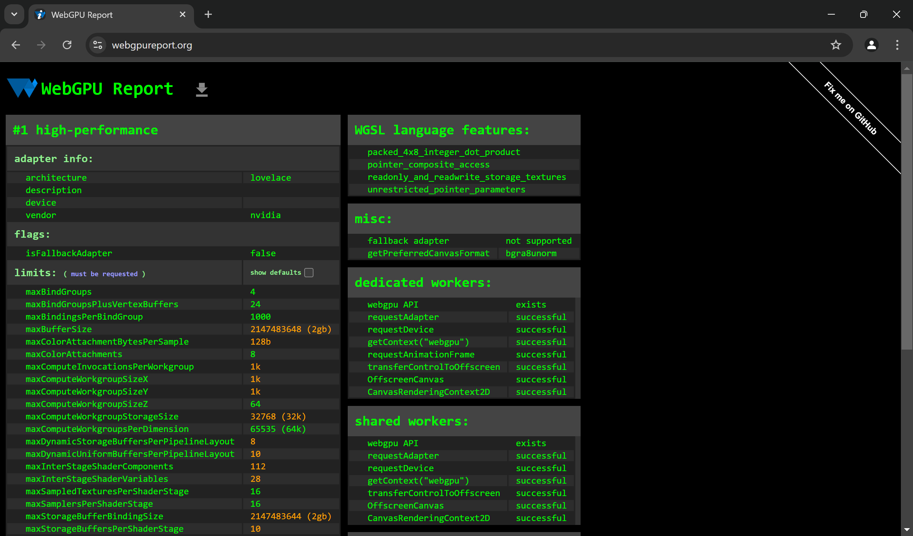

Project 0 Getting Started
====================

**University of Pennsylvania, CIS 5650: GPU Programming and Architecture, Project 0**

* CARLOS LOPEZ GARCES
  * [LinkedIn](https://www.linkedin.com/in/clopezgarces/), [personal website](https://carlos-lopez-garces.github.io/), [twitter](https://x.com/clopezgarces), etc.
* Tested on: Windows 11, 13th Gen Intel(R) Core(TM) i9-13900HX @ 2.20 GHz, RAM 32GB, NVIDIA GeForce RTX 4060, personal laptop.

### Project screenshots

#### Part 2.1.2: modified CUDA project

CUDA application window:

#### Part 2.1.3: Nsight debugging

Image shows `autos` for index 1023 at the bottom and `warp info` at the top:

#### Part 2.1.4: Nsight Systems

Analysis summary:

Timeline:

#### Part 2.1.5: Nsight Compute

Summary tab:

Details tab:

#### Part 2.2: WebGL

Image shows support for WebGL 1 on webglreport.com:

Image shows support for WebGL 2 on webglreport.com:

Image shows support for WebGL 1 and 2 on chrome://gpu:

#### Part 2.3: WebGPU

Image shows support for WebGPU on webgpureport.org:

