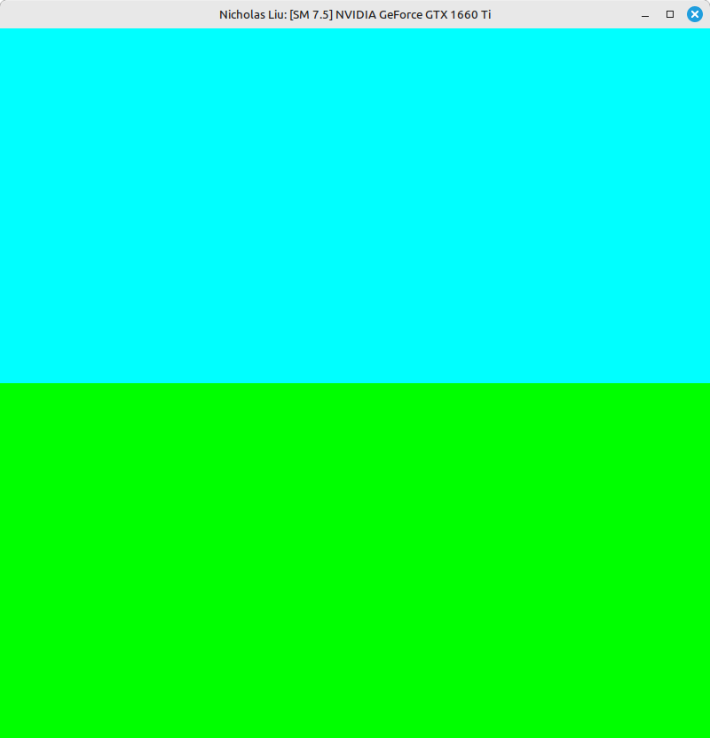
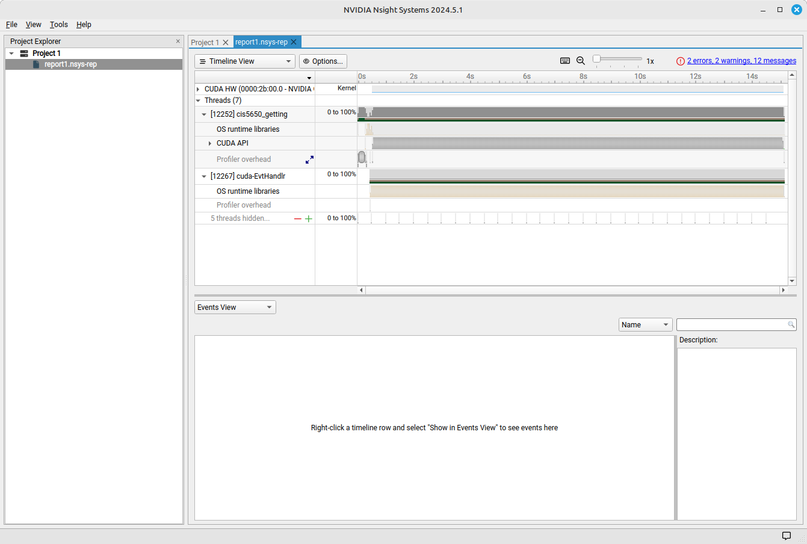
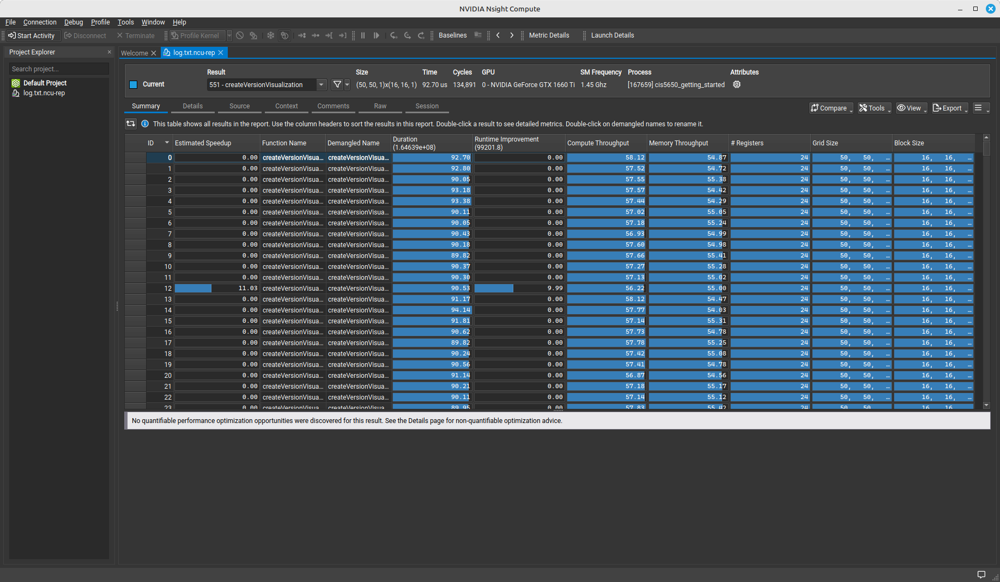

Project 0 Getting Started
====================

**University of Pennsylvania, CIS 5650: GPU Programming and Architecture, Project 0**

* Nicholas Liu
  * [Linkedin](https://www.linkedin.com/in/liunicholas6/)
* Tested on: Linux Mint 22 Wilma, AMD Ryzen 7 5800X @ 2.512GHz, 32GB RAM, GeForce GTX 1660 Ti

### Screenshots

