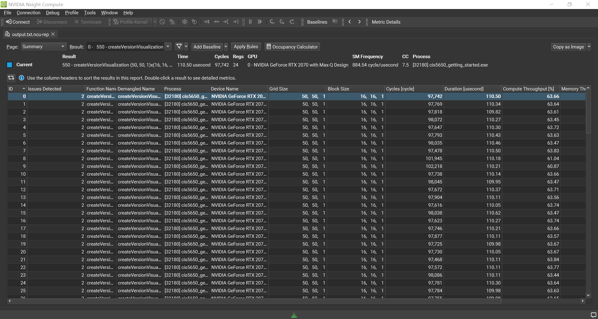
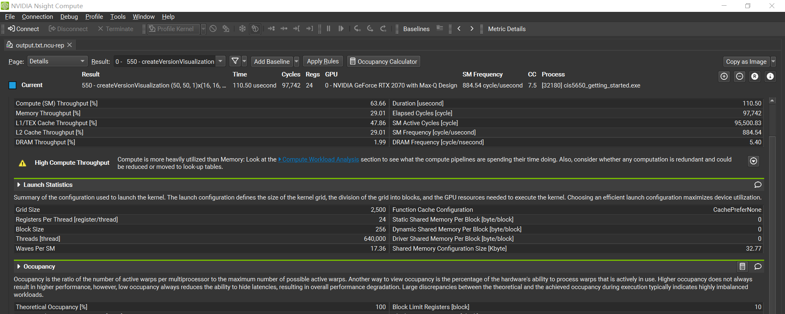
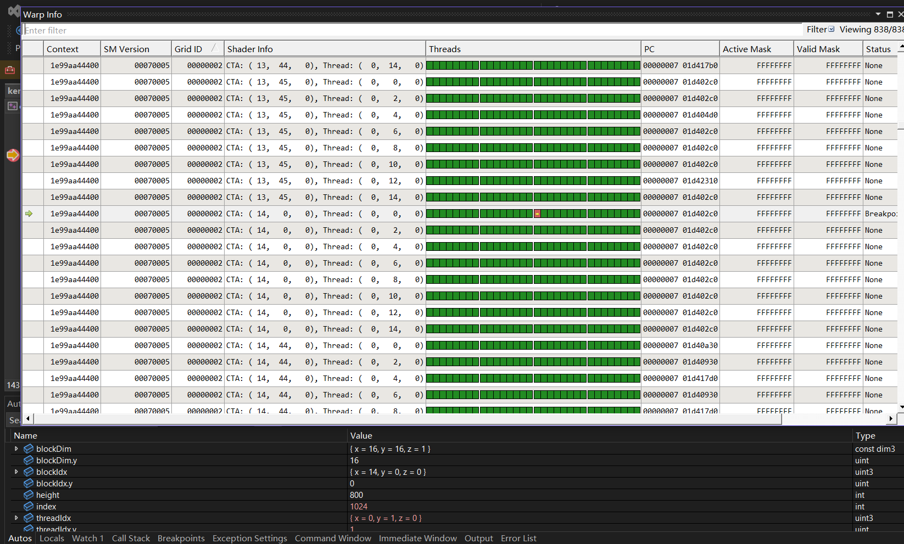
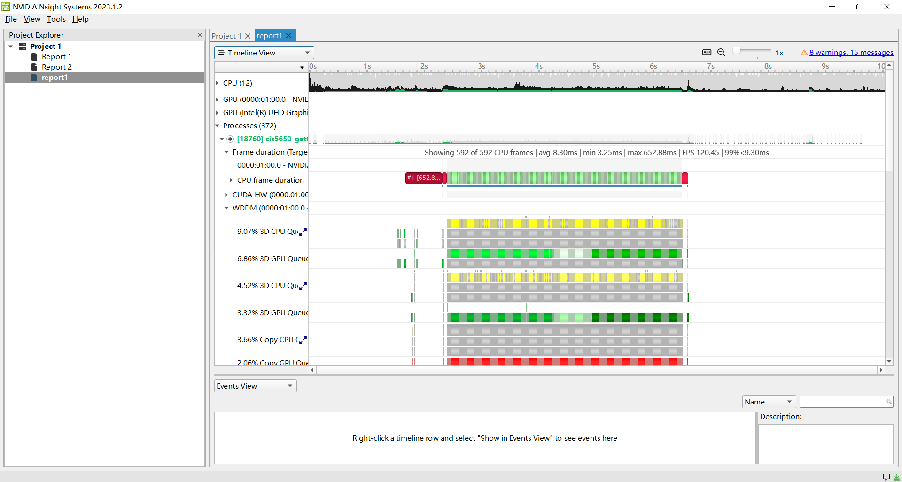
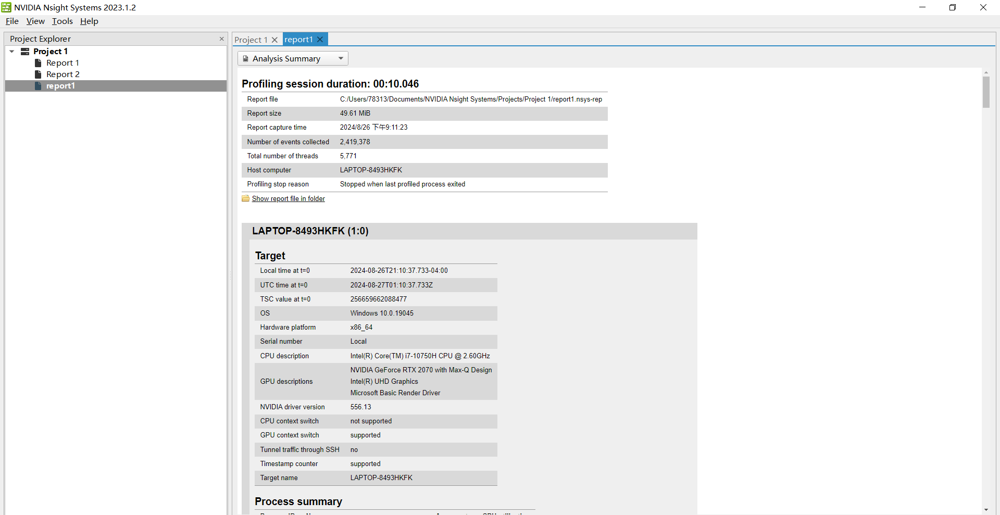
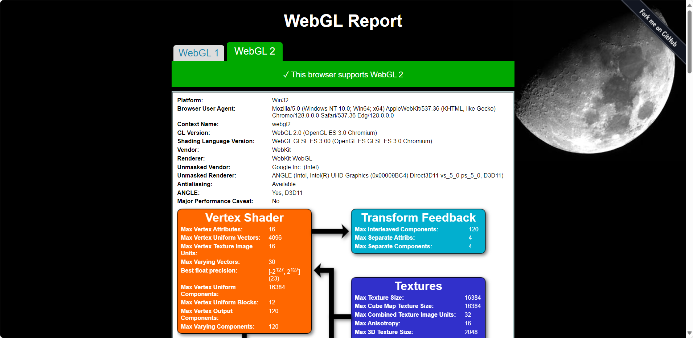
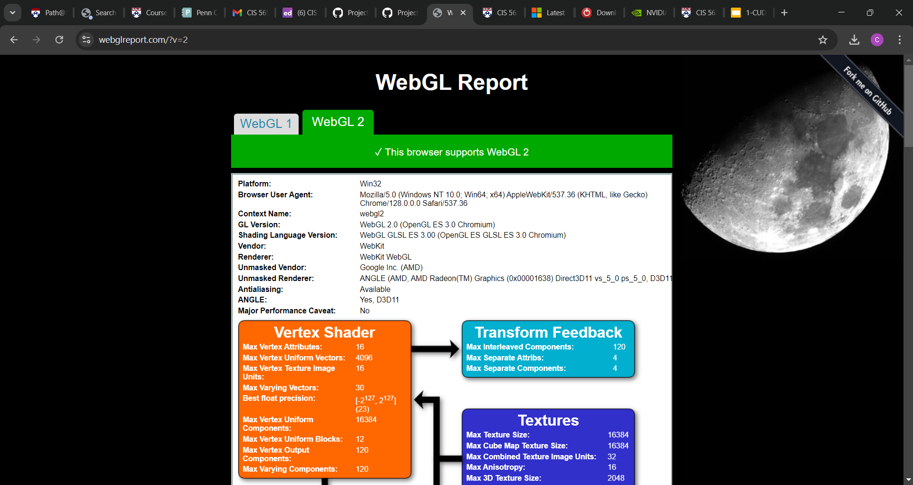

Project 0 Getting Started
====================

**University of Pennsylvania, CIS 5650: GPU Programming and Architecture, Project 0**

- Wang Ruipeng
    - [LinkedIn](https://www.linkedin.com/in/ruipeng-wang-681b89287/)
    - [Personal Website](https://wang-ruipeng.github.io/)
- Tested on: Windows 10, i7-10750H CPU @ 2.60GHz 16GB, RTX 2070 Max-Q 8GB

### ReadMe

CUDA Support  

Nsight Compute   

Nsight Debugging  

Nsight System

WebGL Support

