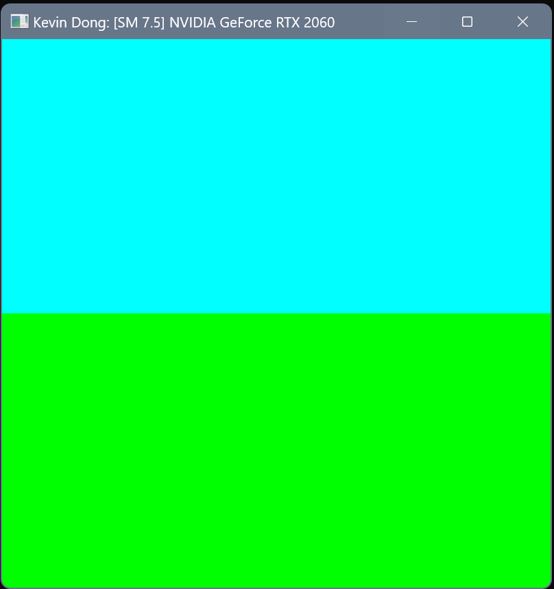
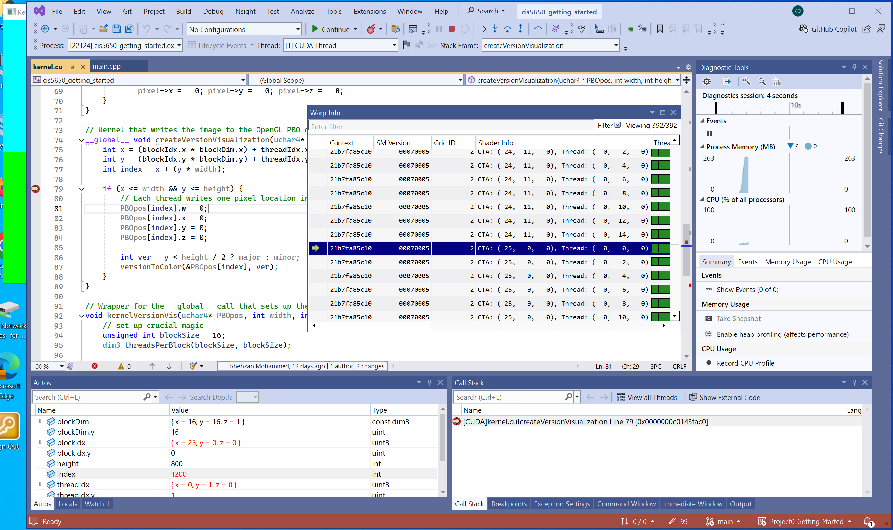
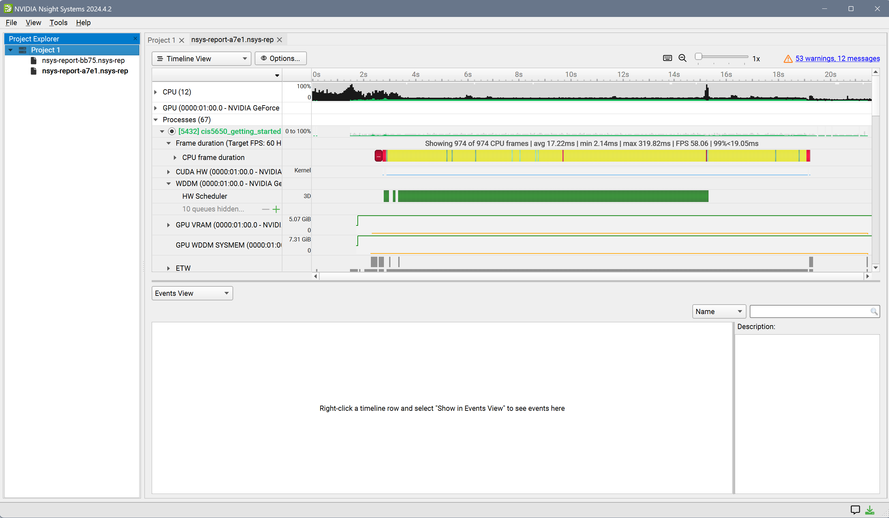
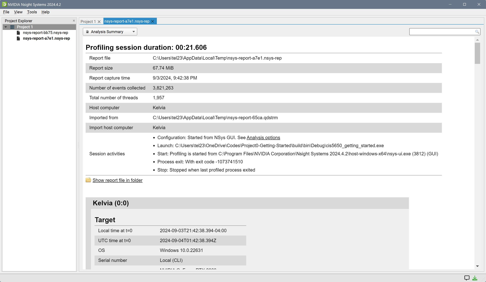
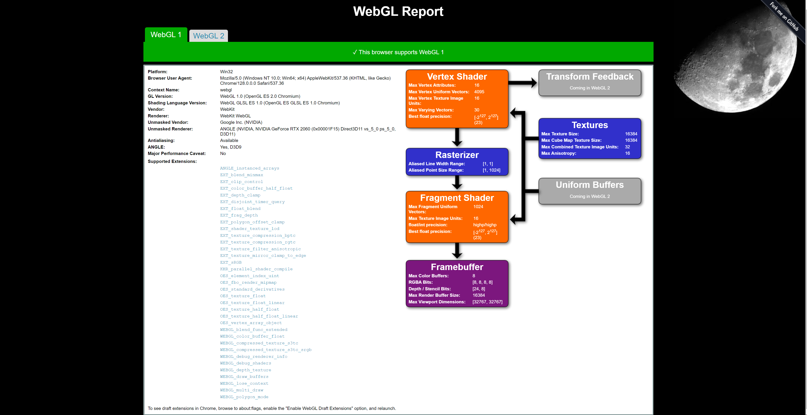
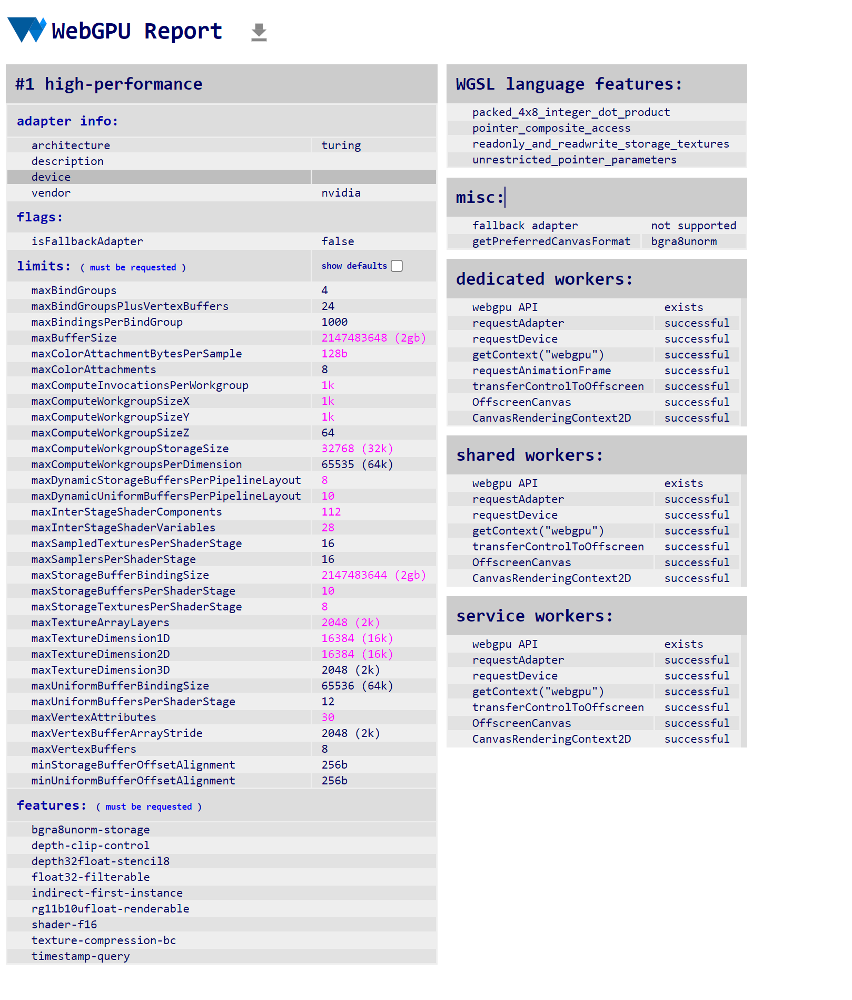

Project 0 Getting Started
====================

**University of Pennsylvania, CIS 5650: GPU Programming and Architecture, Project 0**

* Kevin Dong
  * [LinkedIn](https://www.linkedin.com/in/xingyu-dong/)
* Tested on: Windows 11, Intel(R) Core(TM) i7-10750H CPU @ 2.60GHz 2.59 GHz, GTX 2060

