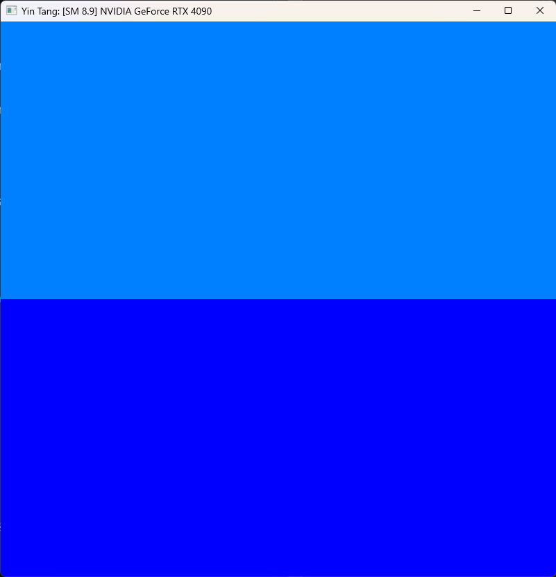
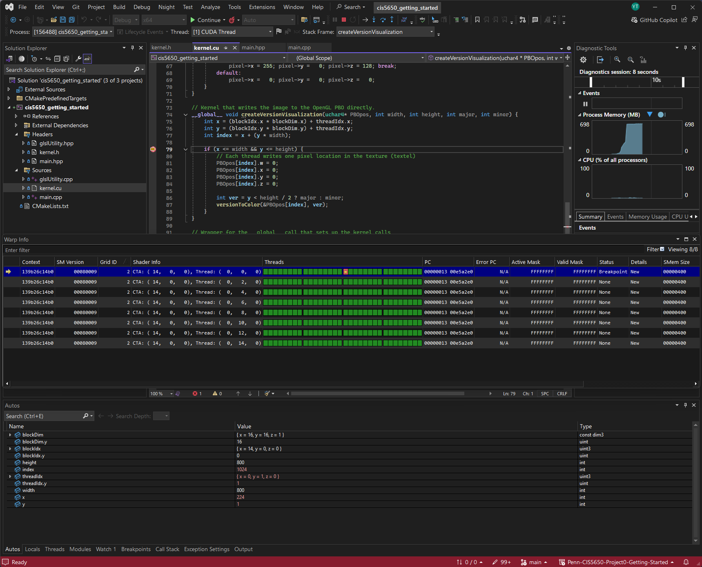
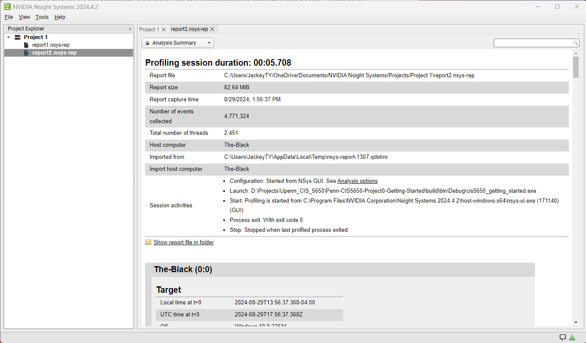
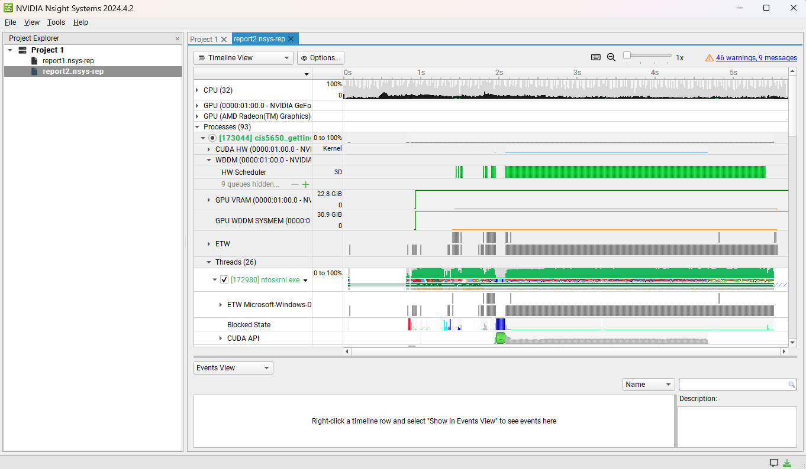
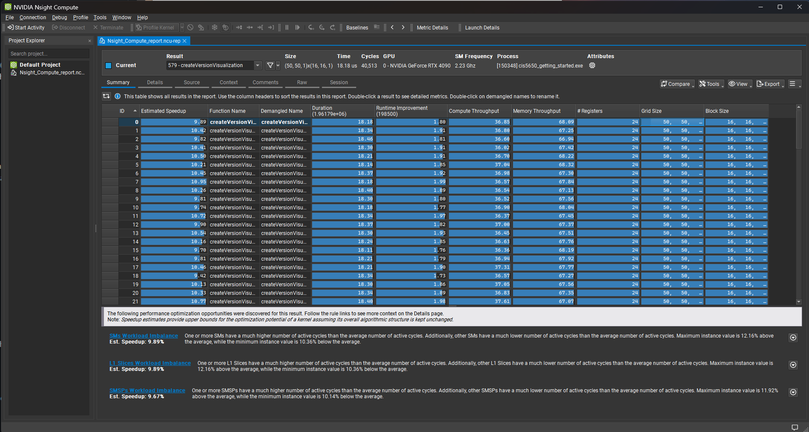
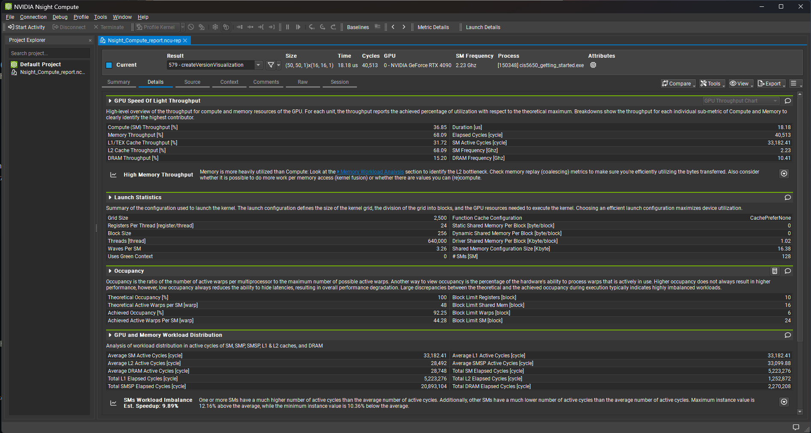
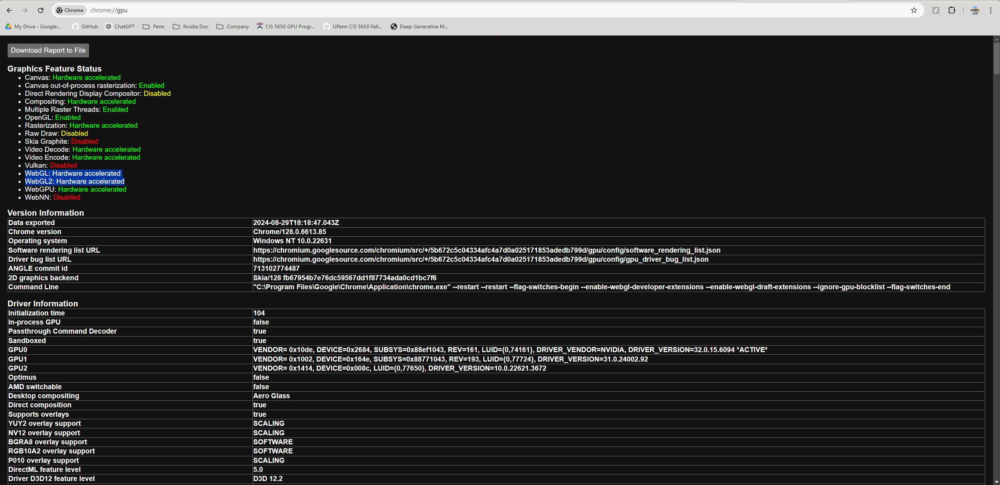
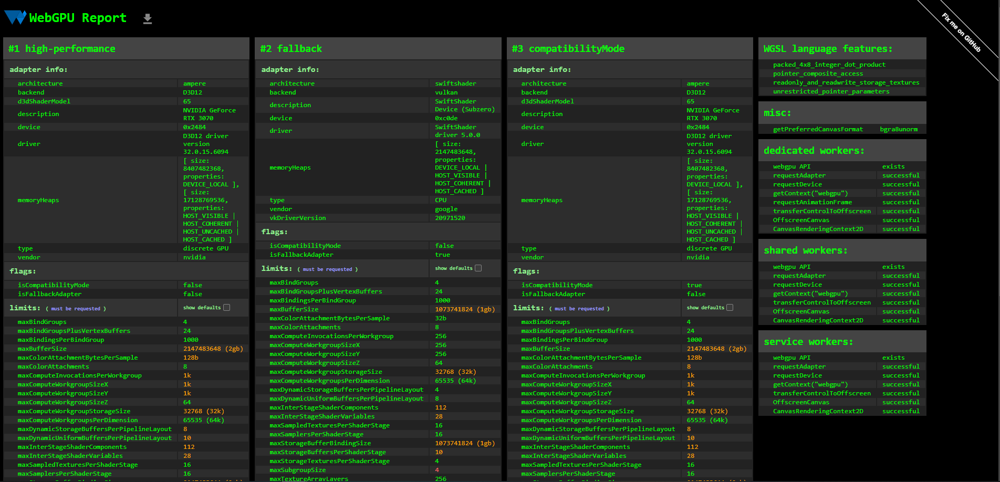

Project 0 Getting Started
====================

**University of Pennsylvania, CIS 5650: GPU Programming and Architecture, Project 0**

* Yin Tang
  * [Linkedin](https://www.linkedin.com/in/yin-tang-jackeyty/), [Github](https://github.com/JackeyTY), [Personal Website](https://jackeytang.com/)
* Tested on: Windows 11 Pro, AMD Ryzen 9 7950X @ 5.00GHz 64GB, NVIDIA GeForce RTX 4090 24GB (personal desktop)
* GPU: GeForce RTX 4090
* Compute Capability: 8.9

**Assignment Screenshots**

* CUDA Project

* VS Nsight Extension Debug

* Nsight System Report

* Nsight Compute Report

* WebGL Support

* WebGPU Support

