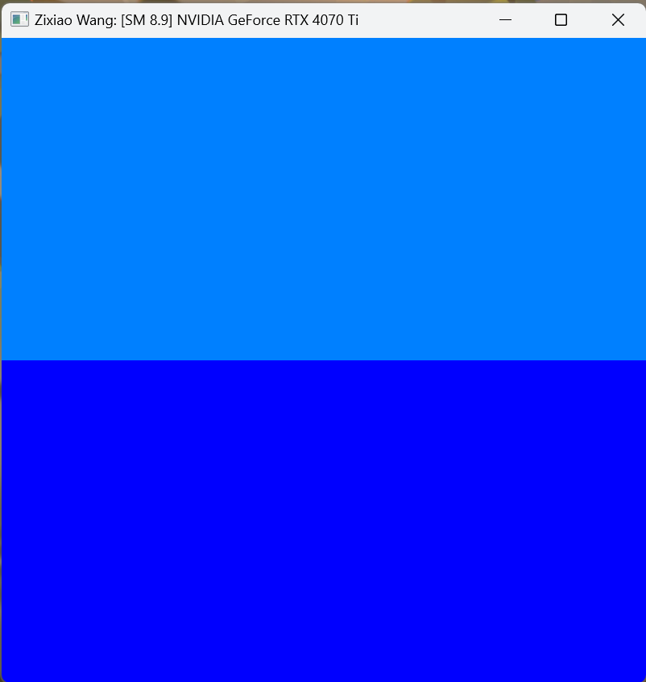
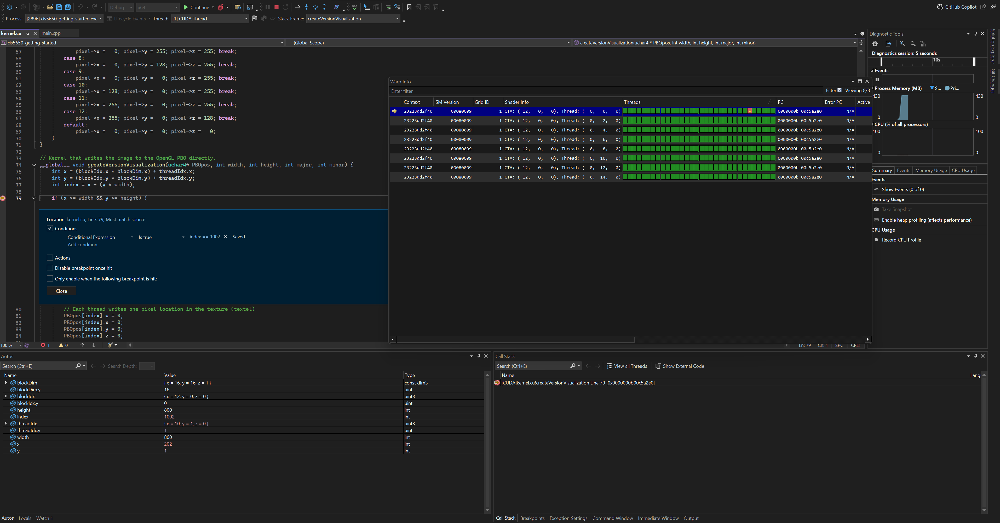
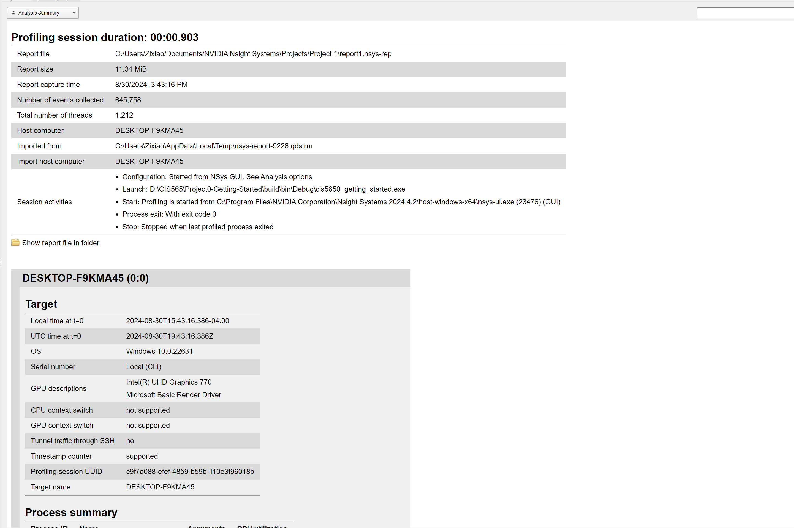
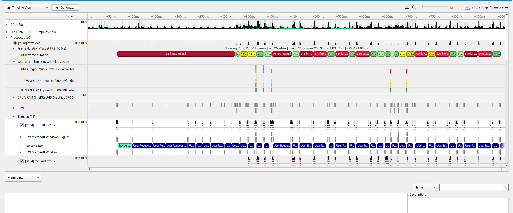
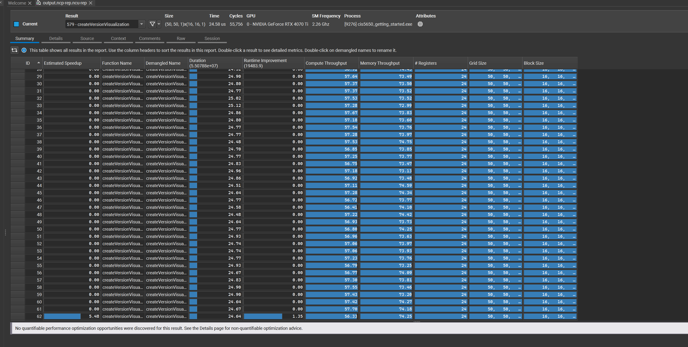
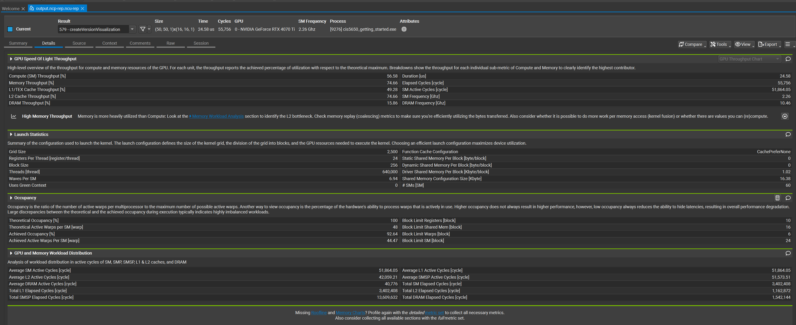
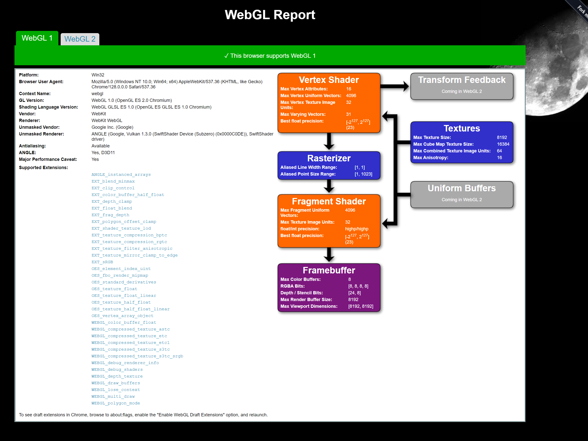
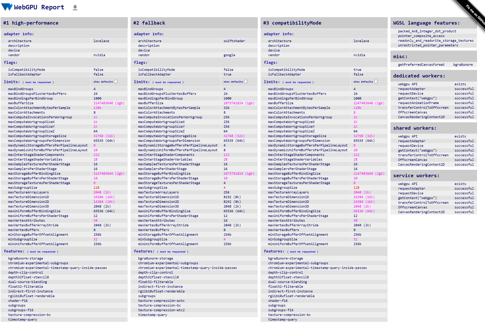
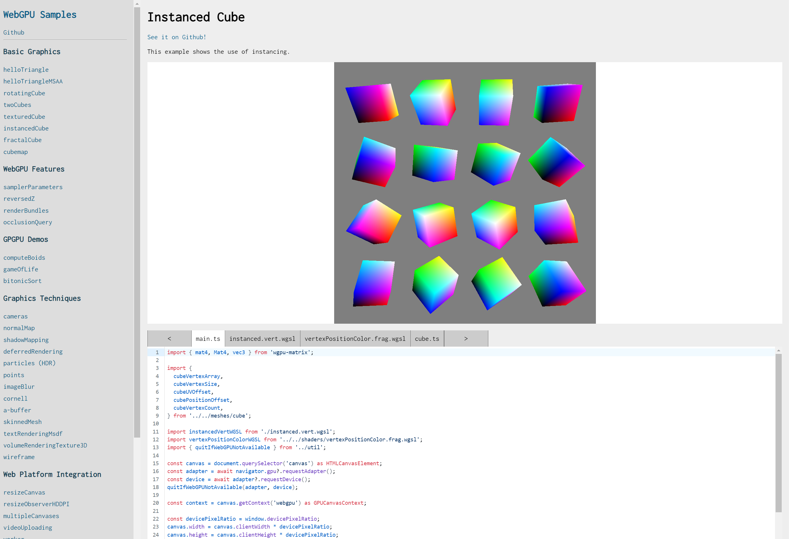

Project 0 Getting Started
====================

**University of Pennsylvania, CIS 5650: GPU Programming and Architecture, Project 0**

* Zixiao Wang
  * [LinkedIn](https://www.linkedin.com/in/zixiao-wang-826a5a255/)
* Tested on: Windows 11, i7-14700K @ 3.40 GHz 32GB, GTX 4070TI 12GB (Personal PC)

### Output images of testing result

Part 2.1.2 Part 2.1.2: Modify the CUDA Project

Part 2.1.3: Nsight Debugging

Part 2.1.4: Nsight Systems

Part 2.1.5: Nsight Compute

Part 2.2: WebGL Report

Part 2.3: WebGPU report and sample instance

