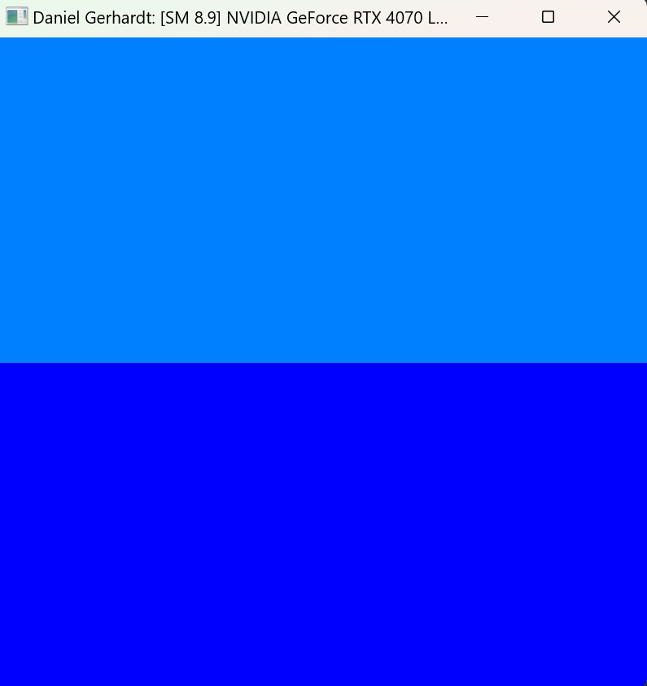
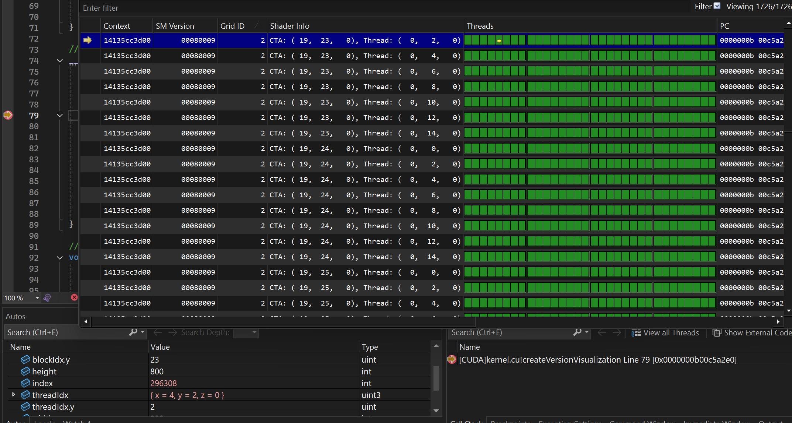
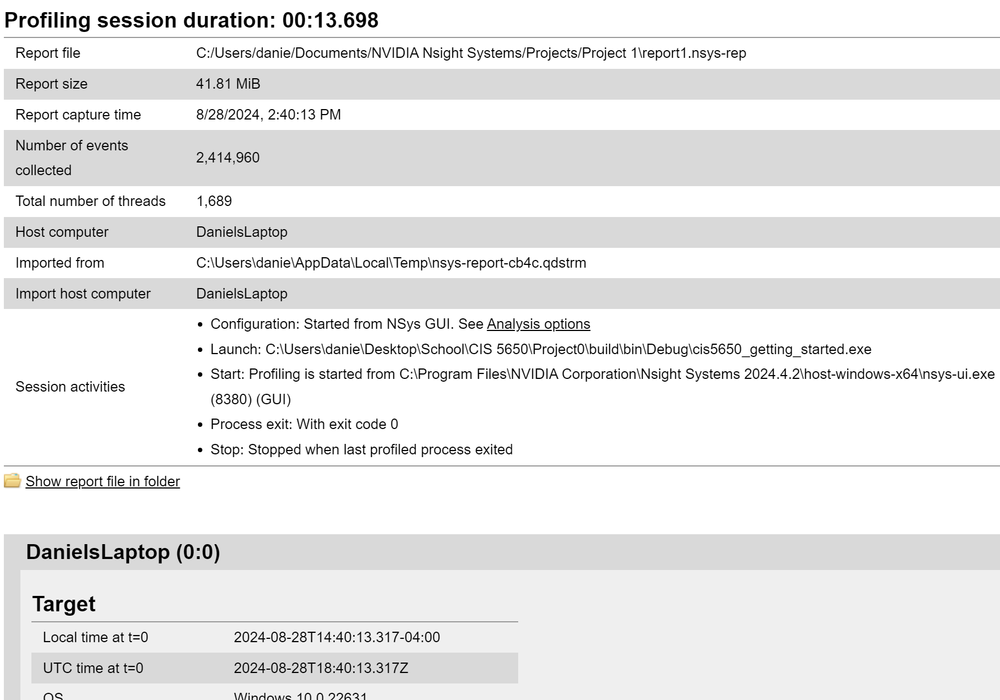
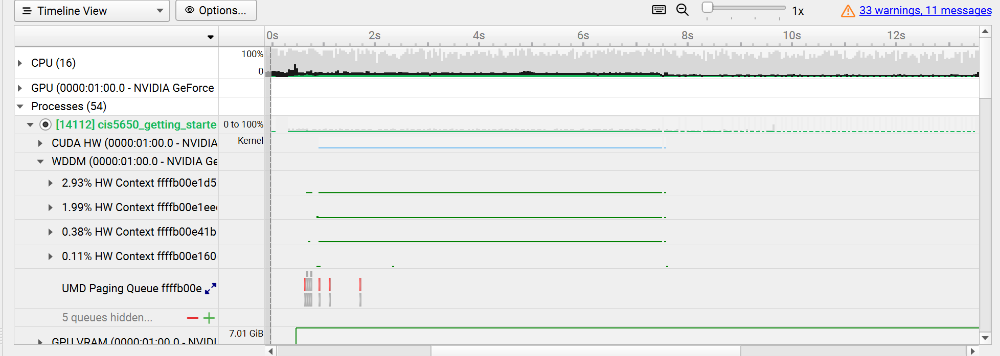
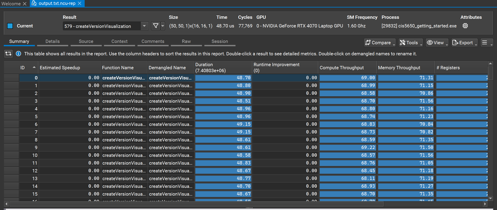
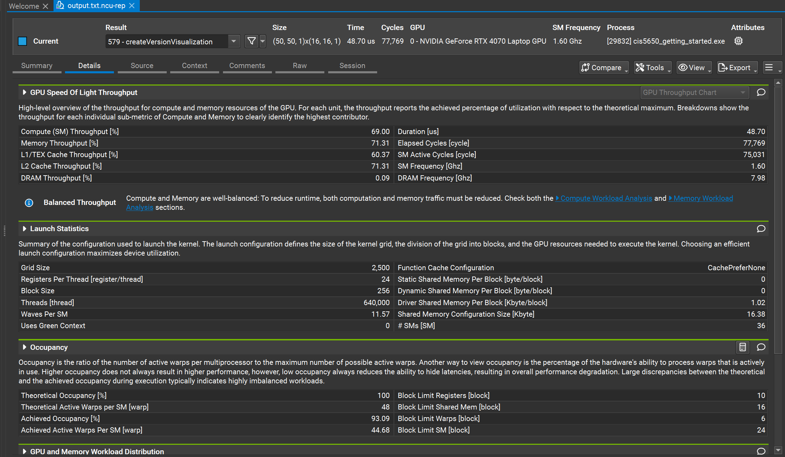
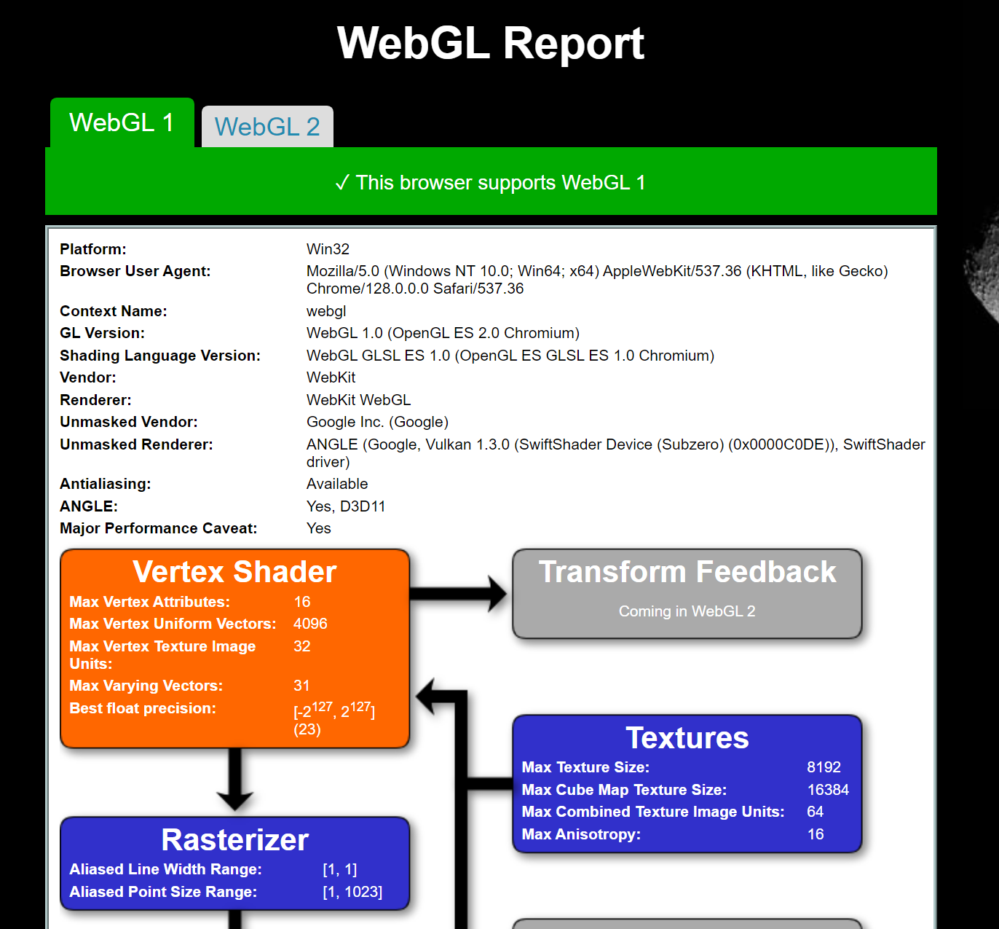
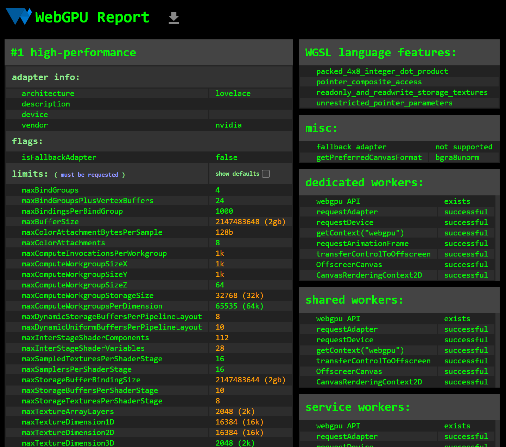

Project 0 Getting Started
====================

**University of Pennsylvania, CIS 5650: GPU Programming and Architecture, Project 0**

* Daniel Gerhardt
  * https://www.linkedin.com/in/daniel-gerhardt-bb012722b/
* Tested on: Windows 23H2, AMD Ryzen 9 7940HS @ 4GHz 32GB, RTX 4070 8 GB (Personal Laptop)

### Project 0 README

The following are images reflecting the preparedness of the computer for future projects in the course.

