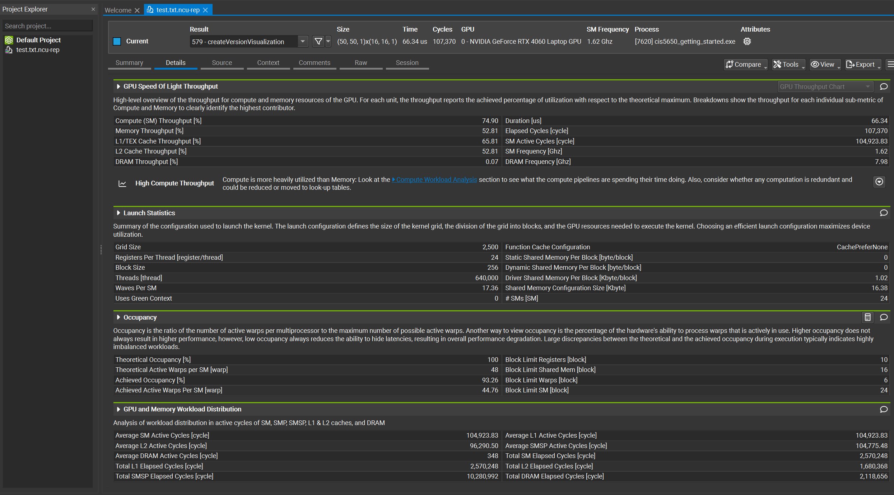

Project 0 Getting Started
====================

**University of Pennsylvania, CIS 5650: GPU Programming and Architecture, Project 0**

* Deze Lyu
* Tested on: Windows 11, AMD Ryzen 5 5600U @ 2.30GHz 16GB, NVIDIA GeForce MX450 9142MB

### Screenshots

#### Part 2.1.2: Modify the CUDA Project and Take a Screenshot

#### Part 2.1.3: Nsight Debugging

#### Part 2.1.4: Nsight Systems

#### Part 2.1.5: Nsight Compute

#### Part 2.2: Project Instructions - WebGL

#### Part 2.3: Project Instructions - WebGPU

