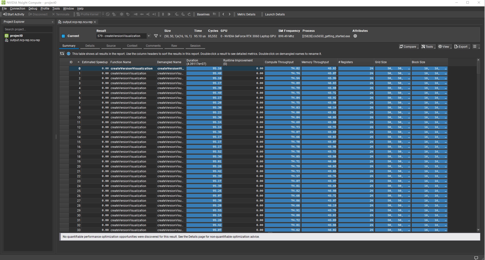

Project 0 Getting Started
====================

**University of Pennsylvania, CIS 5650: GPU Programming and Architecture, Project 0**

* Yifan Lu
  * [LinkedIn](https://www.linkedin.com/in/yifan-lu-495559231/), [personal website](http://portfolio.samielouse.icu/)
* Tested on: Windows 11, AMD Ryzen 7 5800H 3.20 GHz, Nvidia GeForce RTX 3060 Laptop GPU (Personal Laptop)

## Project0 Screenshots

Include screenshots, analysis, etc. (Remember, this is public, so don't put
anything here that you don't want to share with the world.)

#### 1. CUDA Running Screenshot 

#### 2. Nsight Visual Studio Profile Screenshots

#### 3. Nsight Systems

#### 4. Nsight Compute

#### 5. WebGL

#### 6. WebGPU

