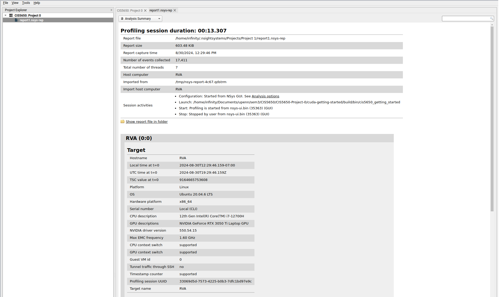
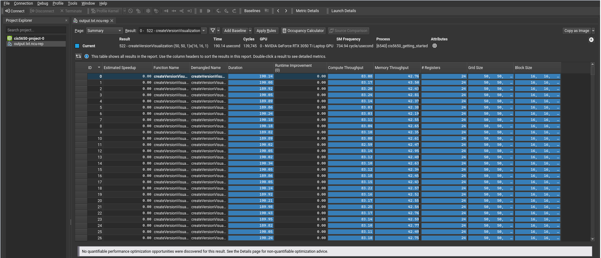
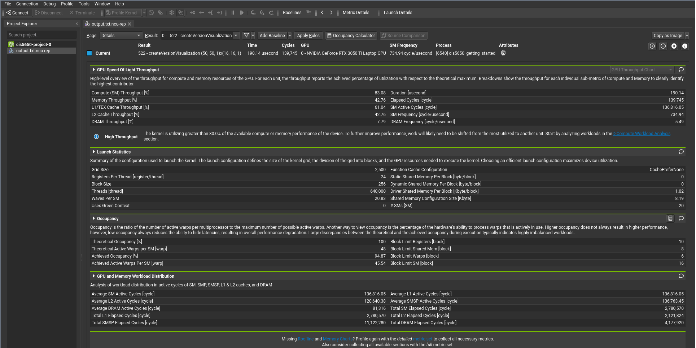
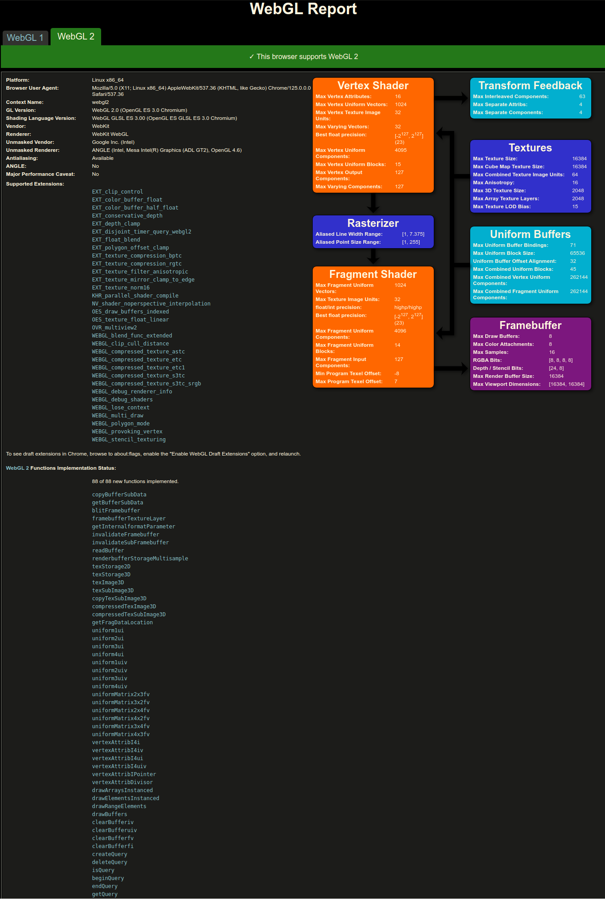

Project 0 Getting Started
====================

**University of Pennsylvania, CIS 5650: GPU Programming and Architecture, Project 0**

* Rahul Aggarwal
  * [LinkedIn](https://www.linkedin.com/in/rahul-aggarwal-32133a1b3/)
* Tested on: Ubuntu 20.04, i7-12700H @ 2.3GHz, RTX 3050 Ti Laptop 4GB (Personal)

### Screenshots

#### 2.1.2 Modify the CUDA Project and Take a Screenshot 

#### 2.1.3 Nsight Debugging on Linux using Nsight Visual Studio Code Edition

#### 2.1.4 Nsight Systems
Analysis Summary

Timeline View

#### 2.1.5 Nsight Compute
Summary

Details

#### 2.2 WebGL
WebGL v1

WebGL v2

`brave://gpu`

#### 2.3 WebGPU
[webgpureport](https://webgpureport.org)

Example

