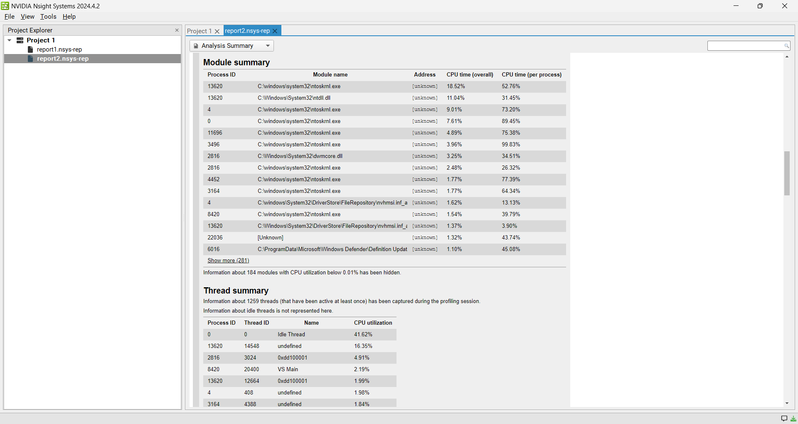

Project 0 Getting Started
====================

**University of Pennsylvania, CIS 5650: GPU Programming and Architecture, Project 0**

* ADITHYA RAJEEV
  * [LinkedIn](https://www.linkedin.com/in/adithyar262/)
* Tested on: Windows 11, i7 13th Gen @ 2.40GHz 16GB, GeForce RTX 4050 8GB (Personal)

### Project Screenshots

#### Part 2.1.2: Modify the CUDA Project and Take a Screenshot

#### Part 2.1.3: Nsight Debugging

#### Part 2.1.4: Nsight Systems

Analysis Summary

Timeline

#### Part 2.1.5: Nsight Compute

#### Part 2.2: Project Instructions - WebGL

#### Part 2.3: Project Instructions - WebGPU

