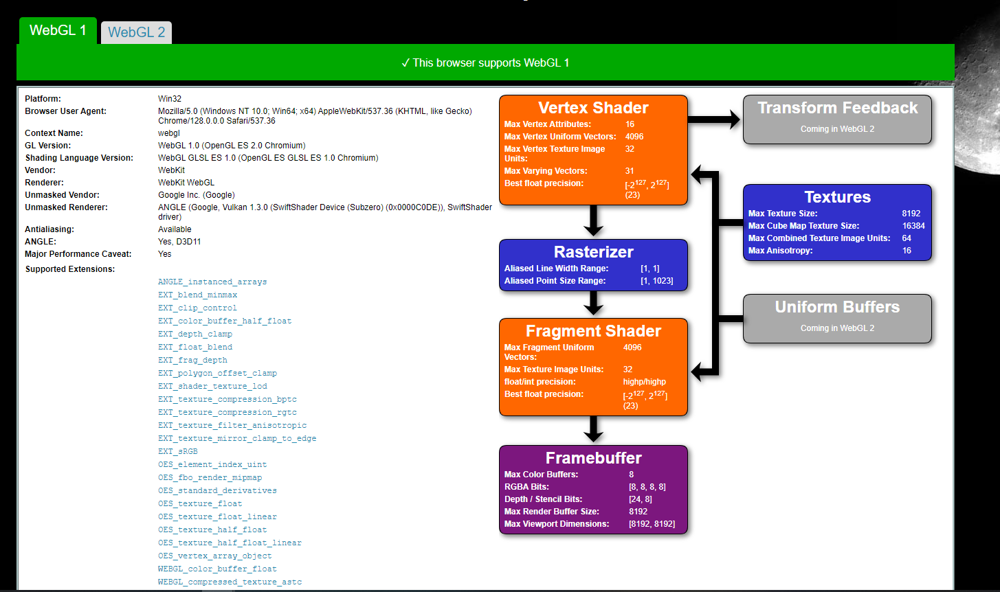

Project 0 Getting Started
====================

**University of Pennsylvania, CIS 5650: GPU Programming and Architecture, Project 0**

* Zhen Ren
  * https://www.linkedin.com/in/zhen-ren-837089208/
* Tested on: Windows 11, i9-13900H @ 2.60 GHz 16GB, RTX 4070 Laptop 8GB (Self laptop)

### Results

#### Output window with name changed

#### Debugging info

#### Nsight System

#### Nsight Compute Summary

#### Nsight Compute Detail

#### WebGL Support

#### WebGPU Support

