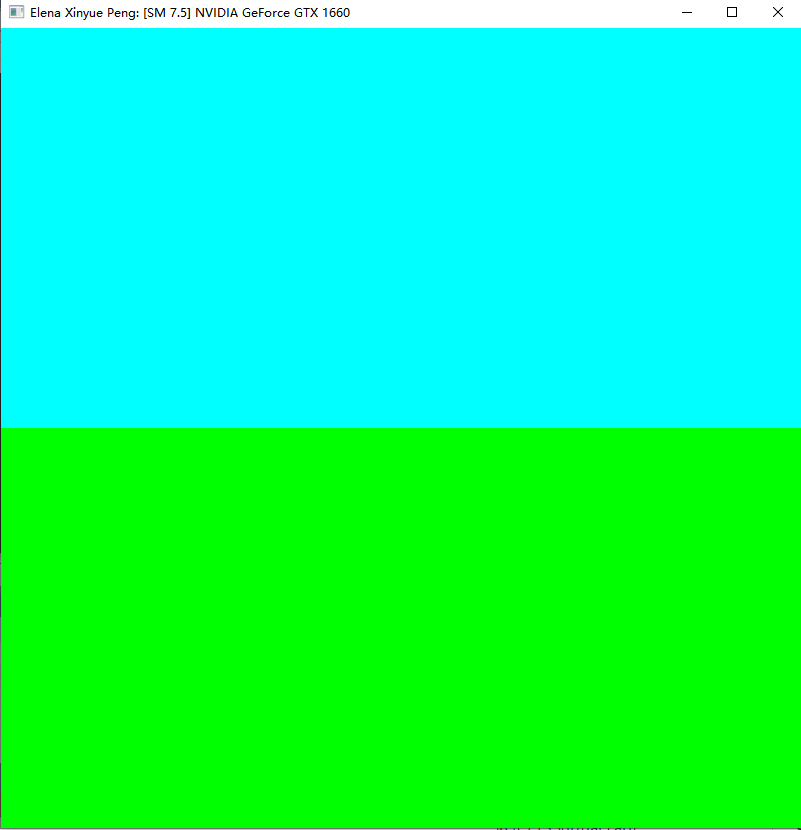
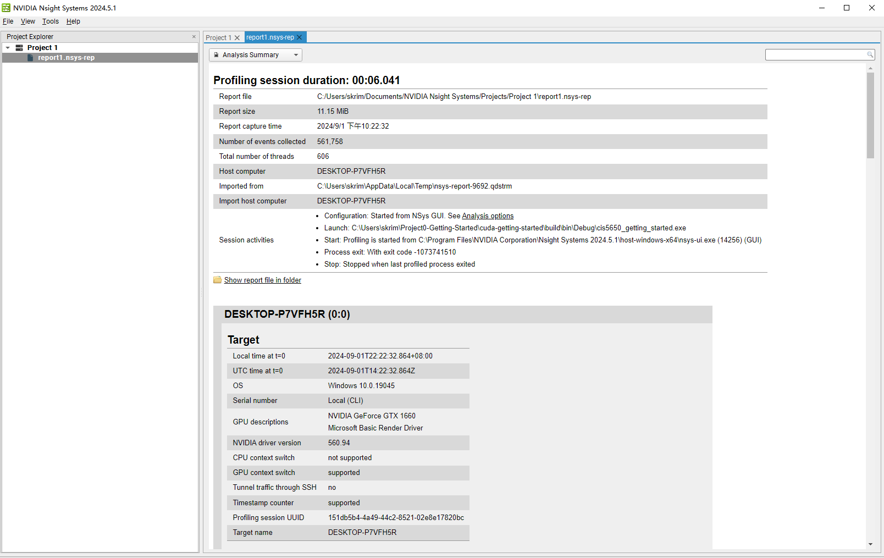
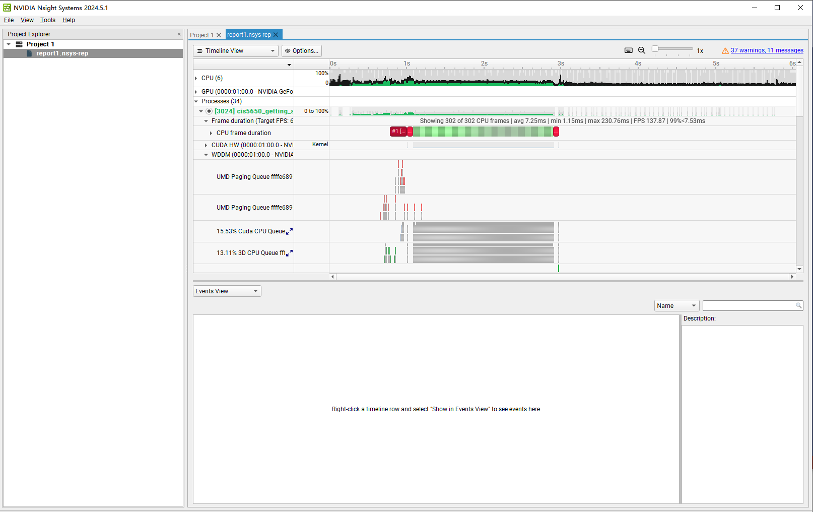
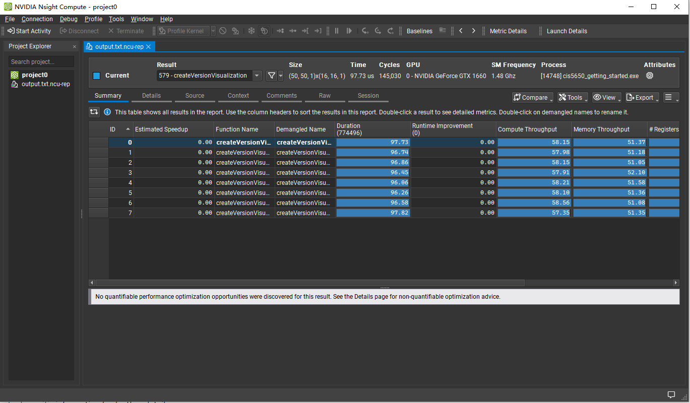
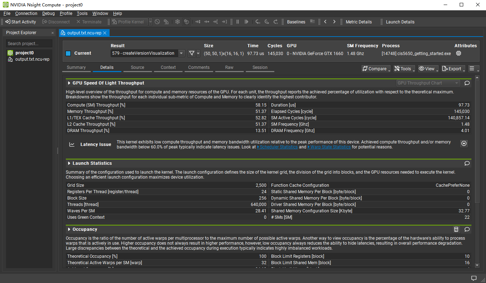
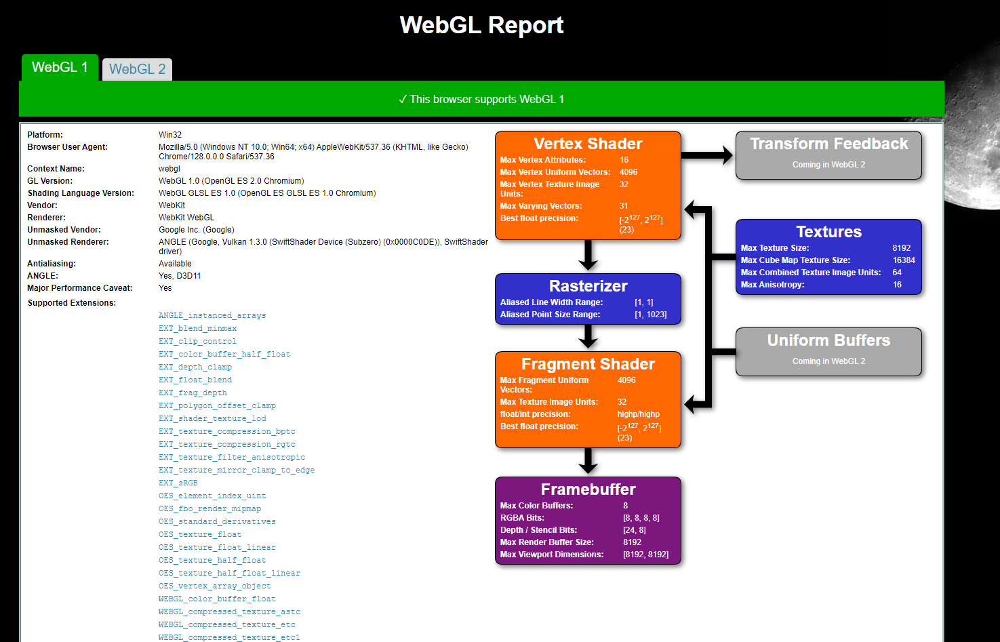

Project 0 Getting Started
====================

**University of Pennsylvania, CIS 5650: GPU Programming and Architecture, Project 0**

* Elena Xinyue Peng
  * https://www.linkedin.com/in/elena-xinyue-peng-8b7a0a173/
* Tested on: (TODO) Windows 10, Intel(R) Core(TM) i5-9400F CPU @ 2.90GH 48GB, NVIDIA GeForce GTX 1660 6144MB (Personal Desktop)

### (TODO: Your README)

### Part 2.1.2: Modify the CUDA Project and Take a Screenshot

### Part 2.1.3: Nsight Debugging

### Part 2.1.4: Nsight Systems

### Part 2.1.5: Nsight Compute

### Part 2.2: Project Instructions - WebGL

### Part 2.3: Project Instructions - WebGPU

Include screenshots, analysis, etc. (Remember, this is public, so don't put
anything here that you don't want to share with the world.)
