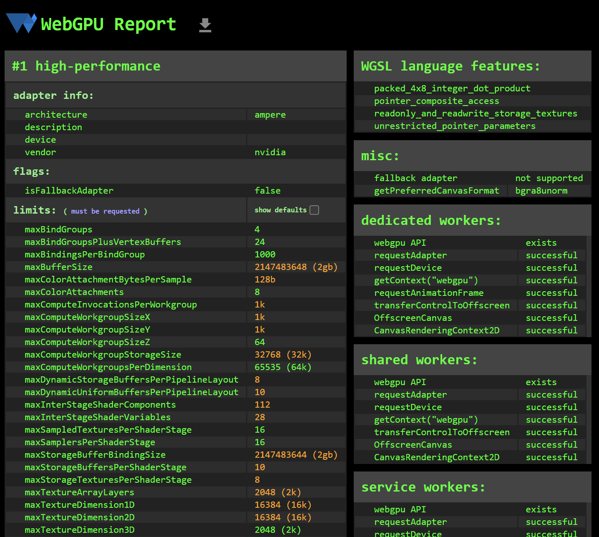

Project 0 Getting Started
====================

**University of Pennsylvania, CIS 5650: GPU Programming and Architecture, Project 0**

* Nadine Adnane
  * [LinkedIn](https://www.linkedin.com/in/nadnane/)
* Tested on my personal laptop (ASUS ROG Zephyrus M16):
* **OS:** Windows 11
* **Processor:** 12th Gen Intel(R) Core(TM) i9-12900H, 2500 Mhz, 14 Core(s), 20 Logical Processor(s) 
* **GPU:** NVIDIA GeForce RTX 3070 Ti Laptop GPU

## Compute Capability of NVIDIA GeForce RTX 3070 Ti Laptop GPU
- 8.6

## CUDA Project

## Autos and Warp Info

## Nsight Systems Timeline

## Nsight Systems Analysis Summary

## Nsight Compute Details

## Nsight Compute Summary

## WebGL Support ✅

## WebGPU Support ✅

