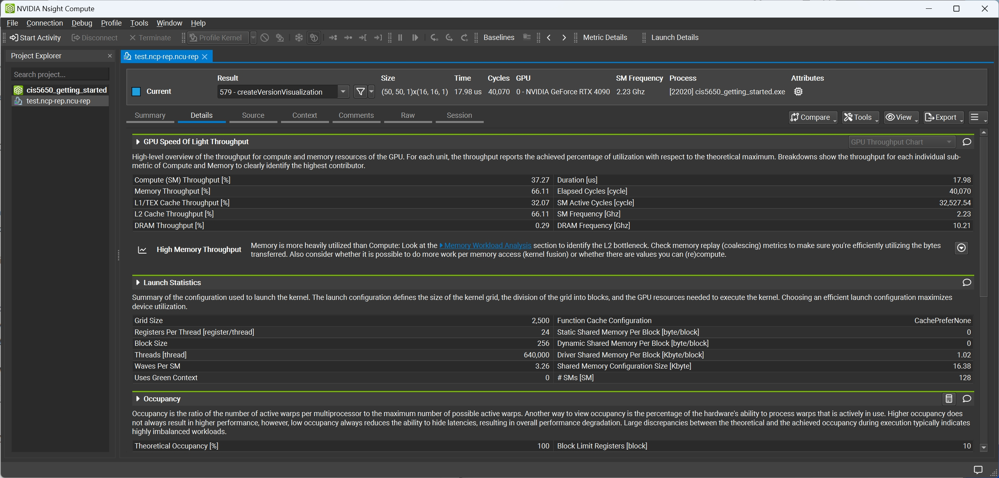

Project 0 Getting Started
====================

**University of Pennsylvania, CIS 5650: GPU Programming and Architecture, Project 0**

* Jichu Mao
  * [LinkedIn](https://www.linkedin.com/in/jichu-mao-a3a980226/), [personal website](https://jichu.art/), etc.
* Tested on: Windows 11,  i7-13700K @ 3.40 GHz, 32GB, RTX 4090 24GB

README
====================
Scrennshots as follows:
## Program

## CUDADebugger

## NsightSystem

## NsightCompute

## WebGLReport

## WebGPUReport

