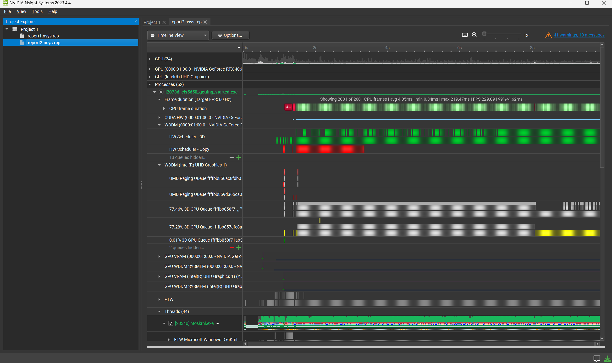

Project 0 Getting Started
====================

**University of Pennsylvania, CIS 5650: GPU Programming and Architecture, Project 0**

* Christine Kneer
  * https://www.linkedin.com/in/christine-kneer/
  * https://www.christinekneer.com/
* Tested on: Windows 11, i7-13700HX @ 2.1GHz 32GB, RTX 4060 8GB (Personal Laptop)

## CUDA Installation

## NSight Debugging

## NSight Systems
* Analysis Summary

* Timeline

## NSight Compute
* Summary

* Details

## WebGL Report

## WebGPU Report
