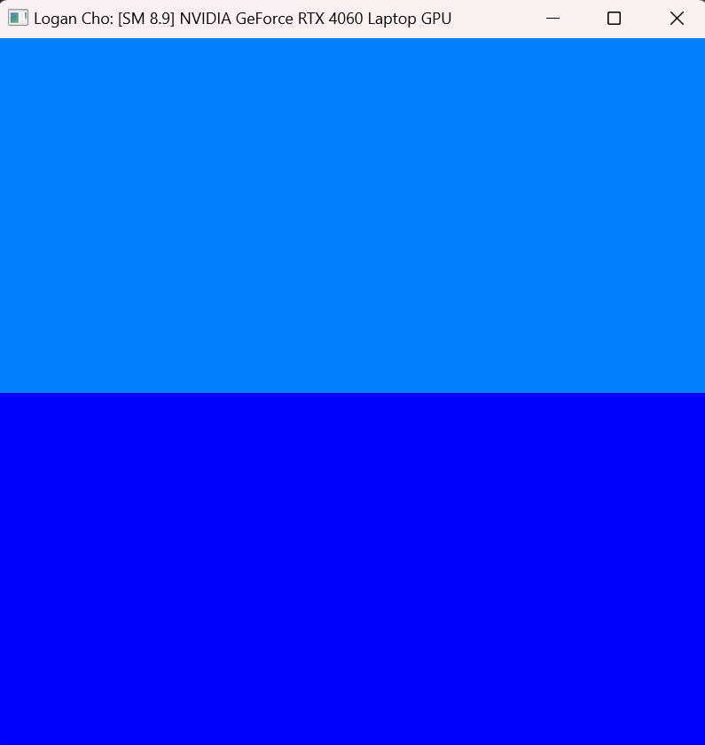
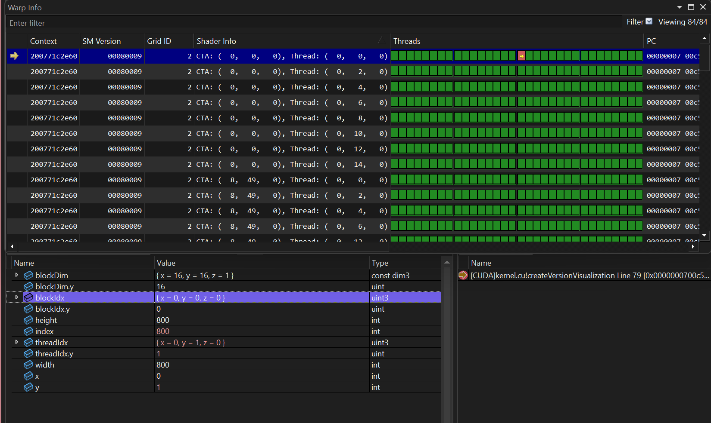
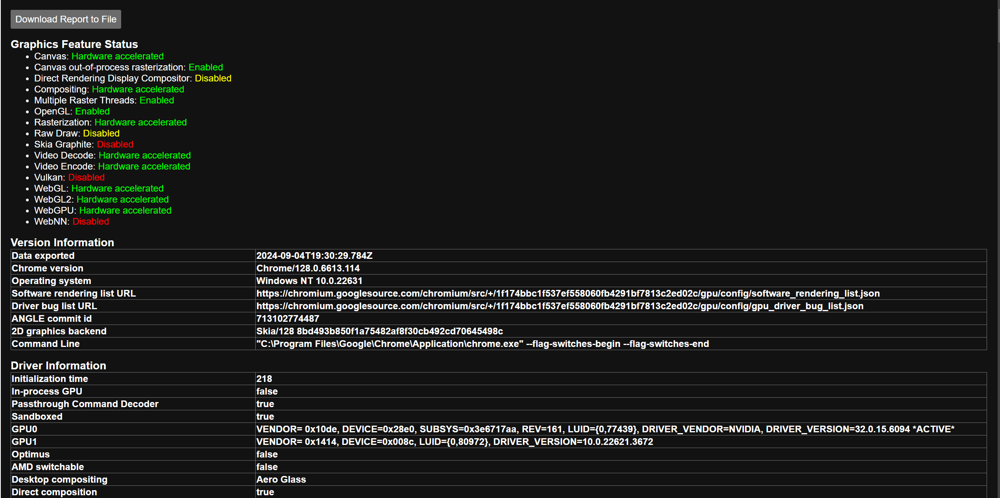
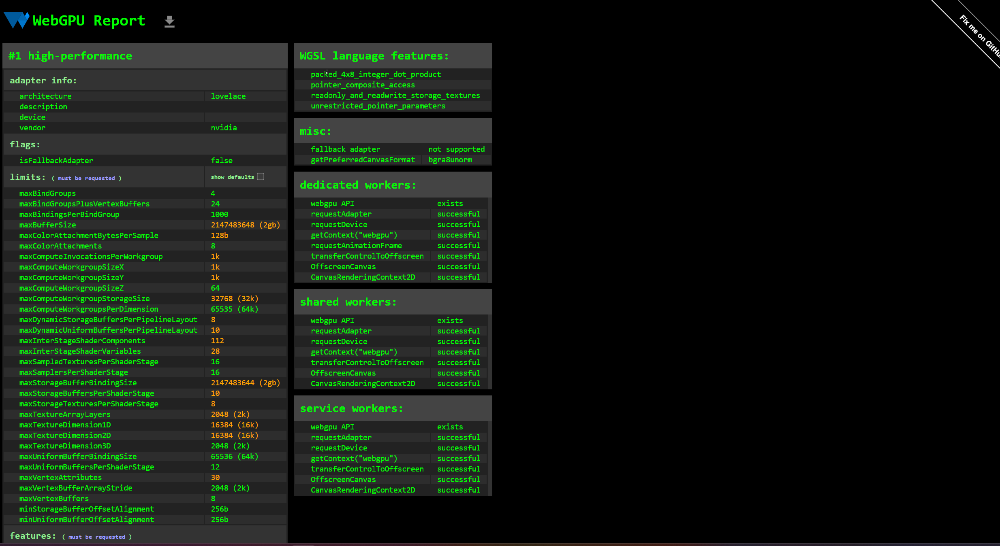

Project 0 Getting Started
====================

**University of Pennsylvania, CIS 5650: GPU Programming and Architecture, Project 0**

* Logan Cho
  * [LinkedIn](https://www.linkedin.com/in/logan-cho/)
  * [Personal Website](https://www.logancho.com/)
* Tested on: Windows 11, 13th Gen Intel(R) Core(TM) i7-13700H, 2.40 GHz, RTX 4060 Laptop GPU

