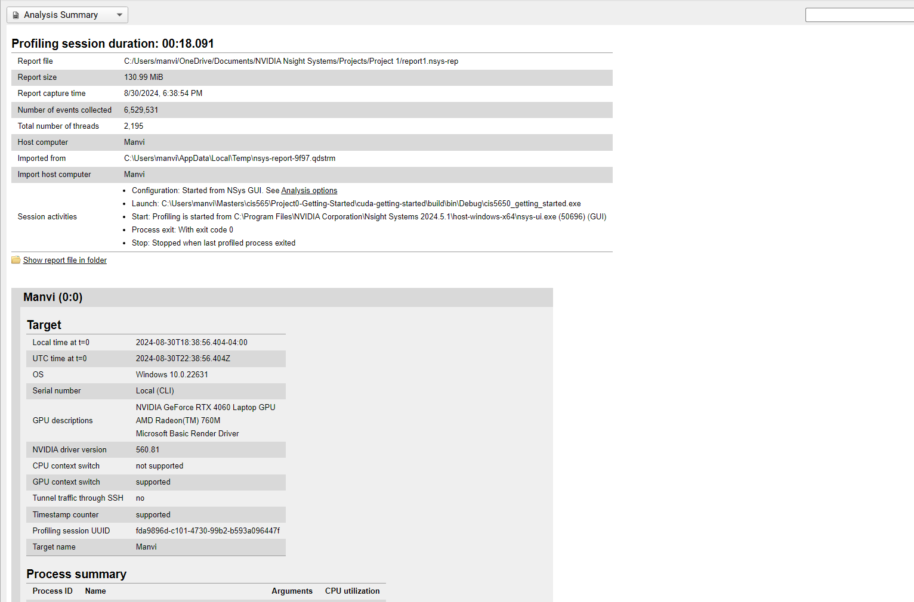

Project 0 Getting Started
====================

**University of Pennsylvania, CIS 5650: GPU Programming and Architecture, Project 0**

* Manvi Agarwal
  * [linkedIn](https://www.linkedin.com/in/manviagarwal27/)
* Tested on: Windows 11, AMD Ryzen 5 7640HS @ 4.30GHz 16GB, GeForce RTX 4060 8GB(personal)

**Project Screenshots**

### Project Screenshots

#### Part 2.1.2: Modify the CUDA Project and Take a Screenshot

#### Part 2.1.3: Nsight Debugging

#### Part 2.1.4: Nsight Systems

#### Part 2.1.5: Nsight Compute

#### Part 2.2: Project Instructions - WebGL

#### Part 2.3: Project Instructions - WebGPU

