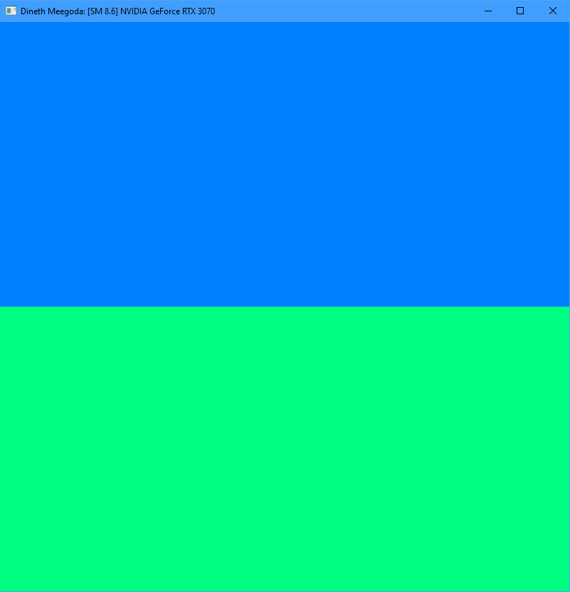

# Project 0 Getting Started

**University of Pennsylvania, CIS 5650: GPU Programming and Architecture, Project 0**

- Dineth Meegoda
  - [LinkedIn](https://www.linkedin.com/in/dinethmeegoda/), [personal website](https://www.dinethmeegoda.com).
- Tested on: Windows 10 Pro, Ryzen 9 5900X 12 Core @ 3.7GHz 32GB, RTX 3070 8GB

## Report

- Compute Capability: 8.6

### Application Output

### NSight Systems Timeline

### NSight Compute Details

### NSight Compute Summary

### WebGL

### WebGPU

