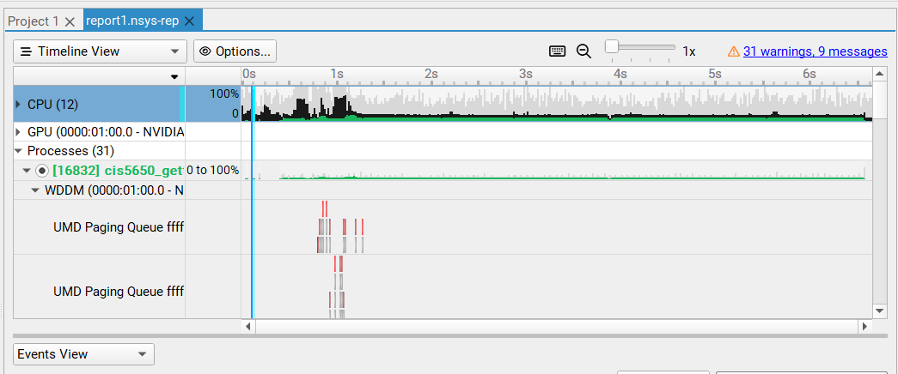
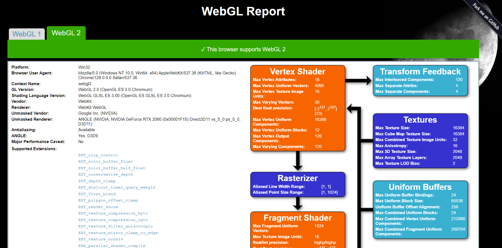

Project 0 Getting Started
====================

**University of Pennsylvania, CIS 5650: GPU Programming and Architecture, Project 0**

* Matt Schwartz
  * [LinkedIn](https://www.linkedin.com/in/matthew-schwartz-37019016b/), [personal website](https://mattzschwartz.web.app/) (needs some updating! :D).
* Tested on: Personal laptop, Windows 10, Intel Core i7-10750 CPU @ 2.60GHz, GEForce RTX 2060

### README

CUDA App with my name in the title bar:

NSight Debugging: Warp Info and Autos:

NSight Systems Summary / Timeline:

NSight Compute Summary:

WebGL Report:

WebGPU Report:
