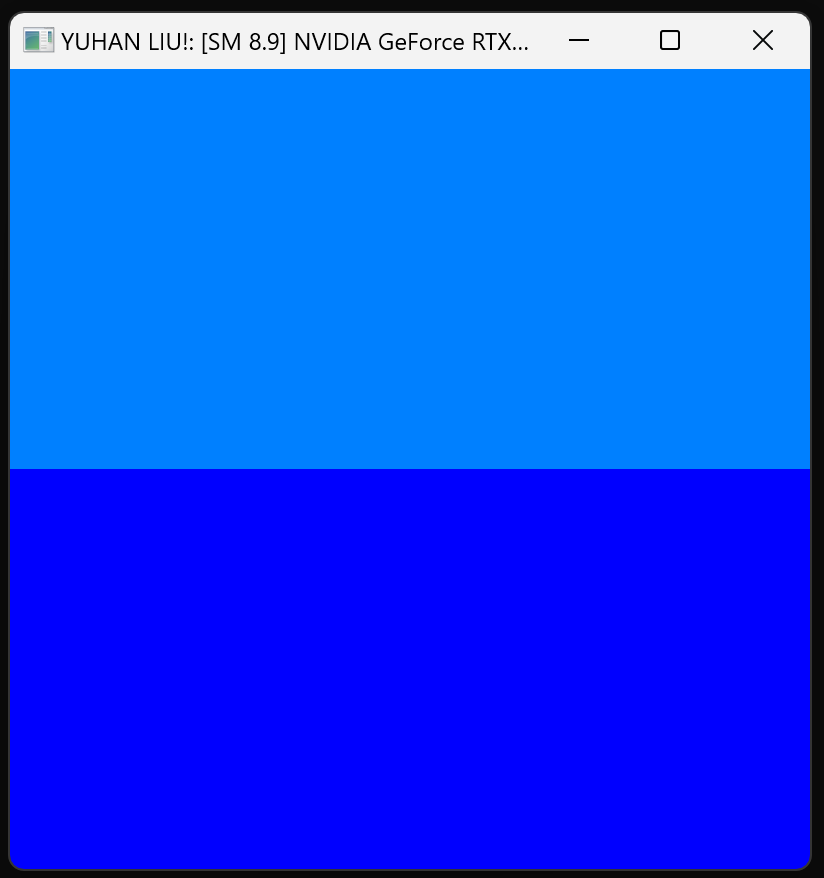
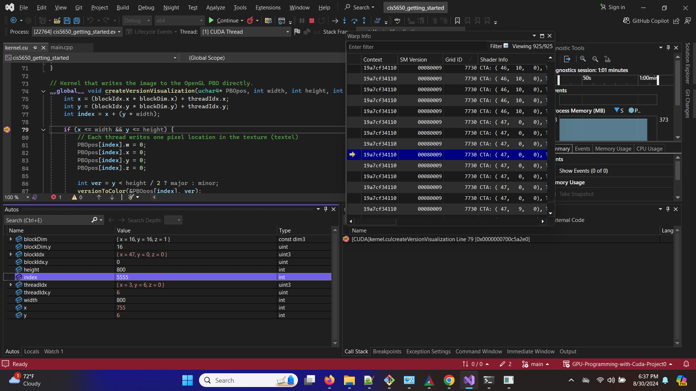

Project 0 Getting Started
====================

**University of Pennsylvania, CIS 5650: GPU Programming and Architecture, Project 0**

* Yuhan Liu
  * [LinkedIn](https://www.linkedin.com/in/yuhan-liu-), [personal website](https://liuyuhan.me/), [twitter](https://x.com/yuhanl_?lang=en), etc.
* Tested on: Windows 11 Pro, Ultra 7 155H @ 1.40 GHz 32GB, RTX 4060 8192MB (Personal Laptop)

### README

NVIDIA GeForce RTX 4060 Laptop GPU, Compute Compatibility: 8.9

Include screenshots, analysis, etc. (Remember, this is public, so don't put
anything here that you don't want to share with the world.)

#### Modify the Cuda Project

#### Nsight Debugging

#### Nsight Systems

#### Nsight Compute

#### WebGL Report

#### WebGPU Report

