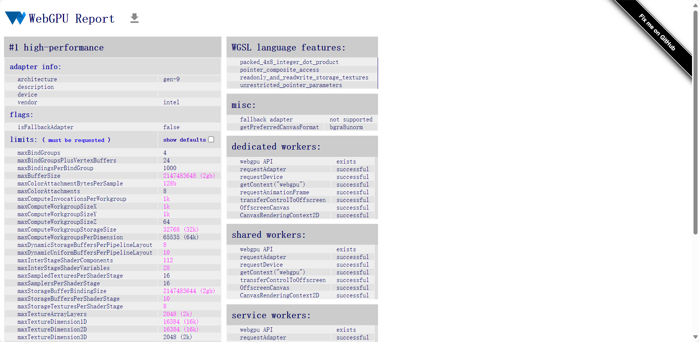
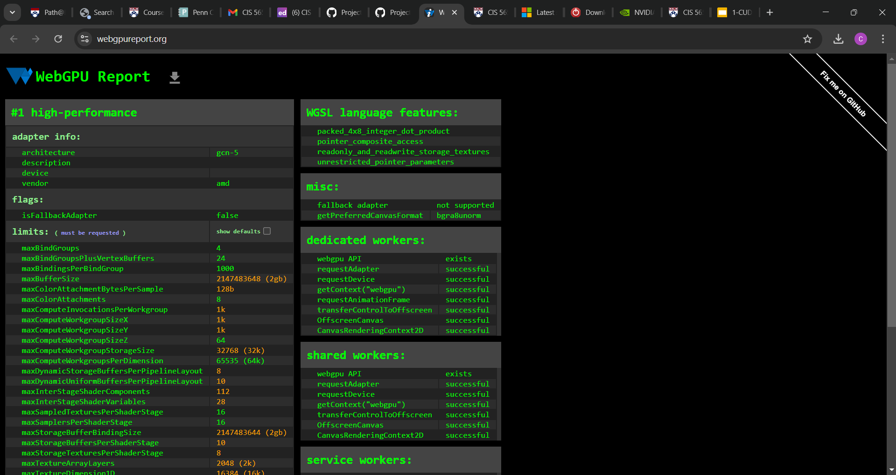

Project 0 Getting Started
====================

**University of Pennsylvania, CIS 5650: GPU Programming and Architecture, Project 0**

* Catherine Cheng
  * [LinkedIn](https://www.linkedin.com/in/catherine-wanning-cheng/), [personal website](https://www.catherine-wanning-cheng.com/projects-1)
* Tested on: Windows 11, AMD Ryzen 7 5800H @ 3.20GHz 16GB, NVIDIA GeForce RTX 3070

Screenshots
=====================

**Part 2.1.2: Modify the CUDA Project and Take a Screenshot**

**Part 2.1.3: Nsight Debugging**

**Part 2.1.4: Nsight Systems**

**Part 2.1.5: Nsight Compute**

**Part 2.2: WebGL**

**Part 2.3: WebGPU**
