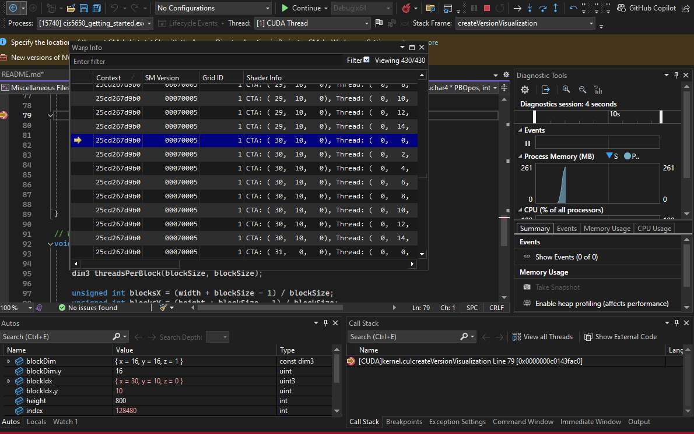

Project 0 Getting Started
====================

**University of Pennsylvania, CIS 5650: GPU Programming and Architecture, Project 0**

* Alyssa Nie
  * (TODO) [LinkedIn](), [personal website](), [twitter](), etc.
* Tested on: CETS Virtual Lab Computer Windows 10 Education - 2th Gen Intel(R) Core(TM) i7-12700 2.10 GHz NVIDIA T1000 Intel(R) UHD Graphics 770

### README 

This is the setup images. 

