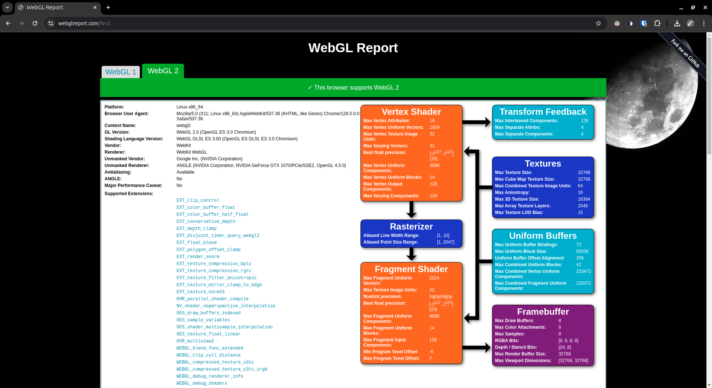

Project 0 Getting Started
====================

**University of Pennsylvania, CIS 5650: GPU Programming and Architecture, Project 0**

* Kyle Bauer
  * [LinkedIn](https://www.linkedin.com/in/kyle-bauer-75bb25171/), [personal website](), [twitter](https://x.com/KyleBauer414346), etc.
* Tested on: Ubuntu 24.04, AMD Ryzen 5 5600G @ 3.9GHz 16GB, GeForce GTX 1070 8GB

Part 2.1.2

Part 2.1.4

Part 2.1.5

Nsight Compute does not support Nvidia 10 Series GPUs' Pascal architecture. Waiting for response on [CETS Virtual Lab computers](https://github.com/kbau121-seas/Project0-Getting-Started/tree/CETS) permissions. [(Related Issue)](https://edstem.org/us/courses/60839/discussion/5194387)

Part 2.2

Part 2.3

