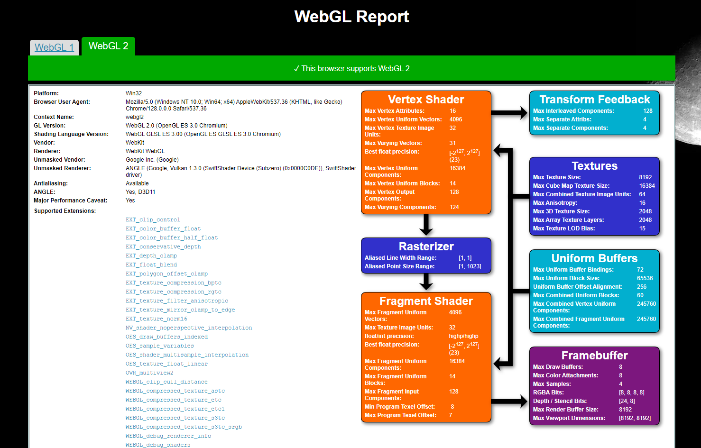

Project 0 Getting Started
====================

**University of Pennsylvania, CIS 5650: GPU Programming and Architecture, Project 0**

* Dominik Kau
  * https://www.linkedin.com/in/dominikkau/
* Tested on: Windows 10, i7-12700 @ 2.10 GHz, 32 GB, T1000 4096 MB (CETS)

## Results

### Part 2.1.1

Compute Capability of T1000: 7.5

### Part 2.1.2

Screenshot showing output of sample program

### Part 2.1.3

Screenshot showing indices of blocks and threads

### Part 2.1.4

Due to missing admin rights, I was not able to open Nsight Systems on the CETS machine

### Part 2.1.5

Due to missing admin rights, I was not able to resolve the GPU Performance Counters error on the CETS machine

### Part 2.2

Screenshots showing support of WebGL1 and WebGL2

### Part 2.3

Screenshot showing support of WebGPU

