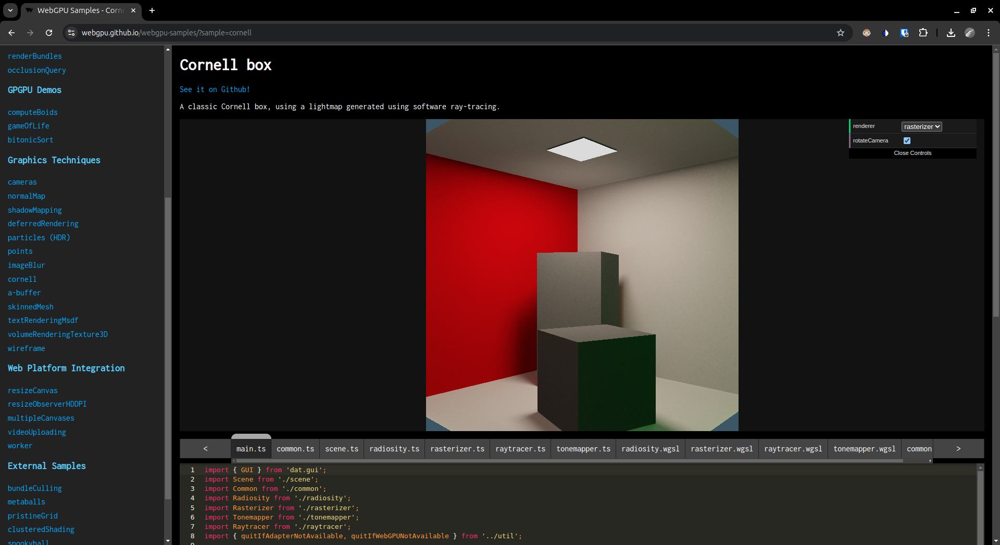

Project 0 Getting Started
====================

**University of Pennsylvania, CIS 5650: GPU Programming and Architecture, Project 0**

* Zhaojin Sun
  * www.linkedin.com/in/zjsun
* Tested on: Windows 11, i9-13900HX @ 2.2GHz 64GB, RTX 4090 Laptop 16GB

#### 2-1-2  
The image below shows the window of my project executes normally.

#### 2-1-3 
The image below shows Autos window and the Warp Info.

#### 2-1-4
The image below shows Analysis Summary of Nsight Systems. 

The image below shows Timeline of Nsight Systems. 

#### 2-1-5
The image below shows Summary of Nsight Systems. 

The image below shows Details of Nsight Systems. 

#### 2-2
The image below shows WebGL is supported on my machine. 

#### 2-3
The image below shows WebGPU is supported on my machine. 

