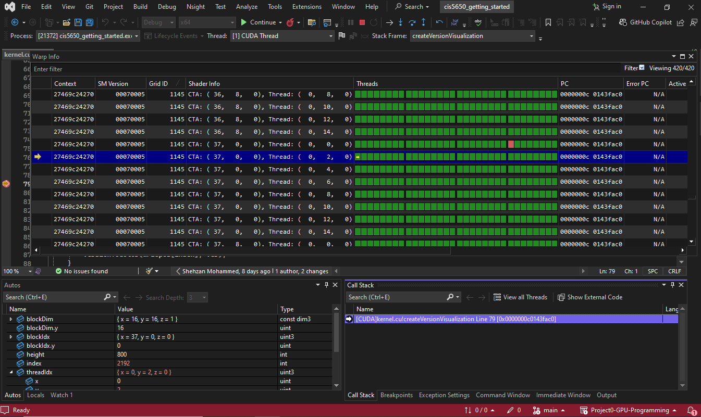

Project 0 Getting Started
====================

**University of Pennsylvania, CIS 5650: GPU Programming and Architecture, Project 0**

* Shreyas Singh
  * [LinkedIn](https://linkedin.com/in/shreyassinghiitr), [personal website](https://github.com/shreyas3156), etc.
* Tested on: Windows 10, i7-12700 @ 2.1GHz 32GB, T1000 (CETS Lab)

### Analysis

The Compute-Capability of the GPU T1000 is 7.5.

### Part 2.1.2

 An example CUDA debug-run.

### Part 2.1.3

This shows the mapping between the `blockIdx`, `threadIdx` and its Shader Info reflected in the CUDA Debugger.

### Part 2.2

The browsers were found to be compatible with WebGL1 and WebGL2.

### Part 2.3

The browsers were found to be compatible with WebGPU.

