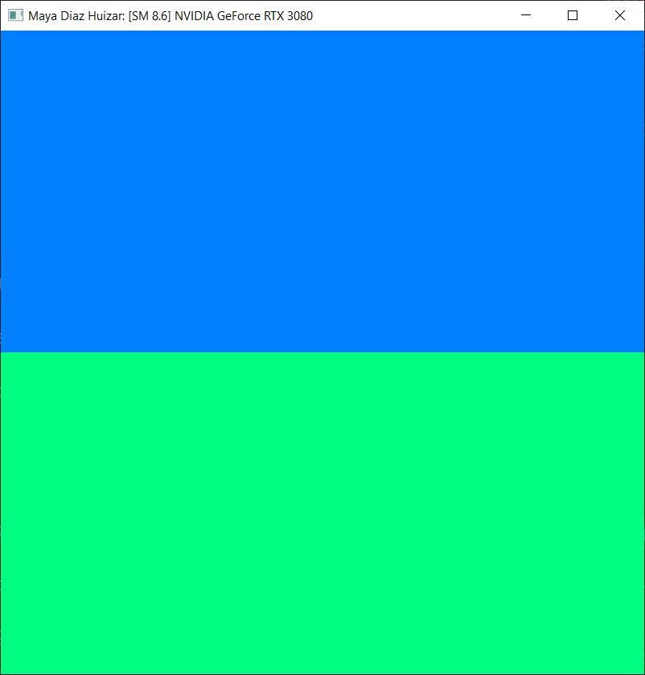
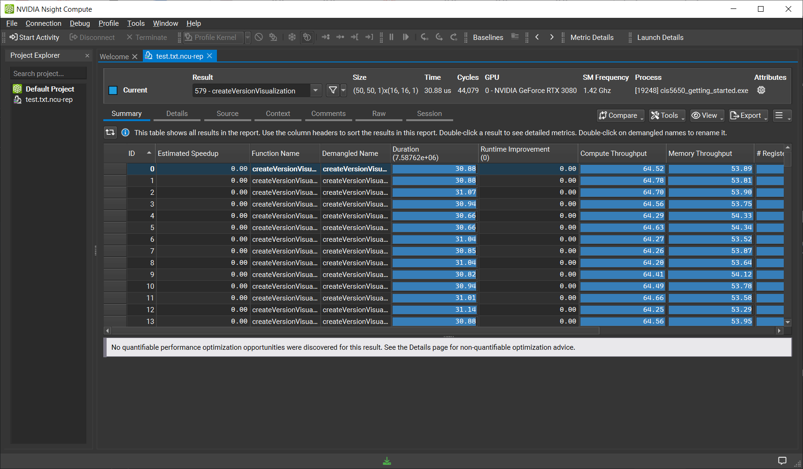
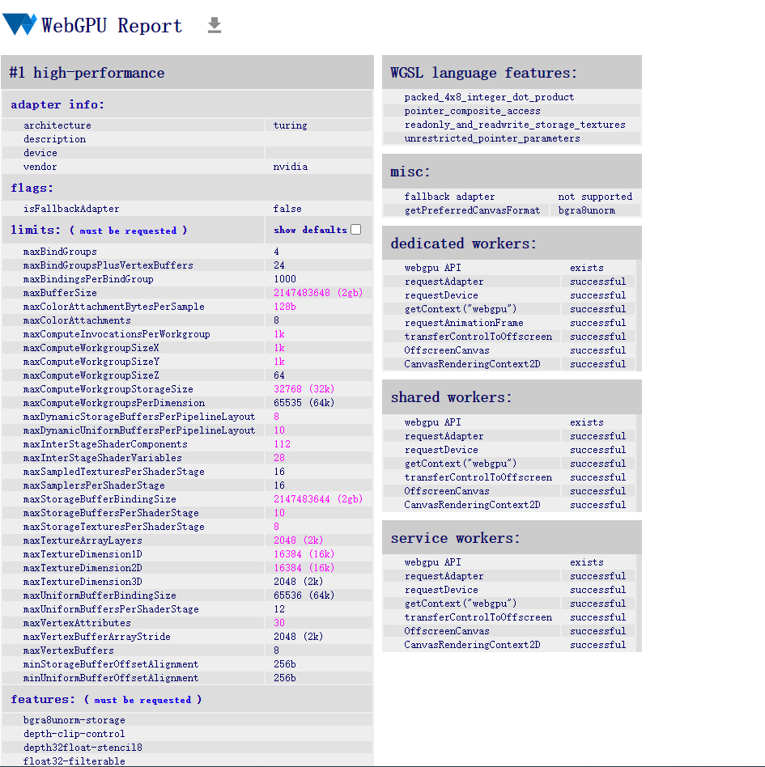

Project 0 Getting Started
====================

**University of Pennsylvania, CIS 5650: GPU Programming and Architecture, Project 0**

* Maya Diaz Huizar
* https://www.linkedin.com/in/maya-huizar-12a643306/
* Tested on: Windows 22H2, R7-5800X @ 3.8 GHz 32GB, RTX 3080 FE 10GB VRAM (Personal PC)
---> will likely switch to linux for next homework, waiting for SSD so i can dual boot. will revert to windows if i can't get something to work.

Include screenshots, analysis, etc. (Remember, this is public, so don't put
anything here that you don't want to share with the world.)

